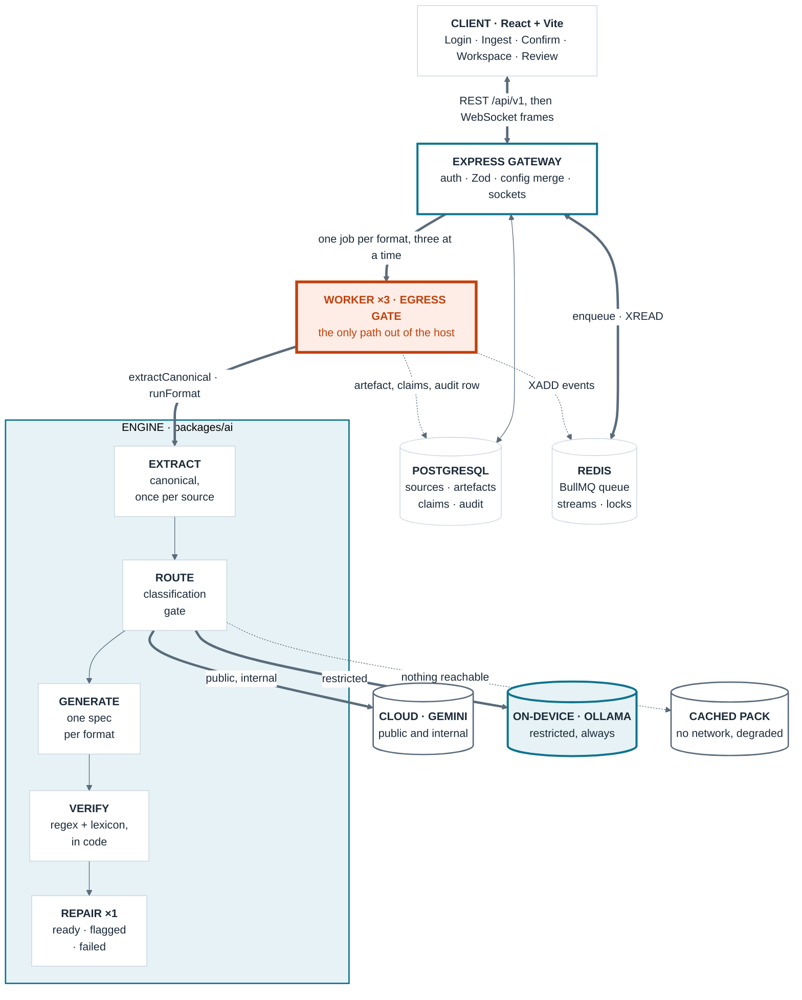
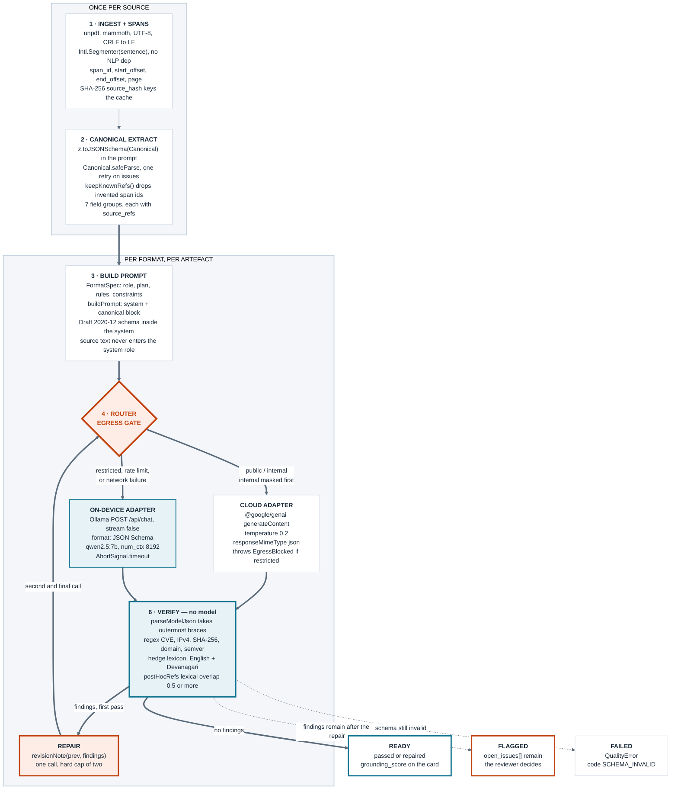

# Mermaid source for the deck figures

Paste each block into <https://mermaid.live>, or a Markdown preview that renders mermaid.

**Every block starts with an `init` line that forces a light theme in our palette.** Your
earlier renders came out dark, which cannot go on a white slide. Keep that line and the
figure renders the same wherever you paste it.

**Exporting for PowerPoint**

1. mermaid.live → paste → **Actions → PNG**, and set the scale to **3x** before exporting.
   At 1x the text is soft once PowerPoint scales it up.
2. SVG exports sharper still and scales without limit, but PowerPoint sometimes drops the
   fonts. If the SVG looks wrong on the slide, fall back to the 3x PNG.
3. For a transparent background, change `'background':'#FFFFFF'` to `'background':'transparent'`.
4. Everything is 24px-equivalent or larger at 3x. If a judge will read it from across a room,
   raise `'fontSize'` to `18px` and re-export rather than scaling the image up in PowerPoint.

---

## F2 · Whole system architecture

**Goes on slide 3** (left, about two-thirds width) and opens the architecture note. This is
the merge of your tier map, the engine internals, the provider fallback and the write-backs.

**Presenting it:** read top to bottom, then stop on the orange band. One tier can reach a
provider, and the classification check lives inside it. That is the whole security argument,
and it is why the merge was worth doing — in the separate diagrams that fact was split across
two pictures.

---

## F7 · The AI engine

**Goes in the architecture note**, and on slide 3 only if there is room after the screenshot.
The subgraphs carry the point that matters: steps 1–2 run once per source, everything after
runs per format.

**Three lines in here earn their place in a Q&A**

- **`postHocRefs` lexical overlap** answers *why no RAG?* — one source fits in the context
  window, so citation matching is term overlap. No embeddings, no vector store, nothing to
  search at scale.
- **`6 · VERIFY — no model`** — regex and a lexicon, not a second model grading the first.
  A model grading a model can be wrong in the same direction twice.
- **`keepKnownRefs()`** — the model can invent a span id, and we drop any it invents.
  Saying that is stronger than claiming it never happens.

If it renders too wide, delete the `subgraph ONCE` / `end` lines and put steps 1–2 in a
caption instead.

---

## F1 · The four-word pipeline

Optional. Slide 2 already carries this as a text strip, which reads better than a diagram at
that size. Use this version only in the architecture note, or if the strip will not fit.

```mermaid
%%{init: {'theme':'base','themeVariables':{
  'background':'#FFFFFF',
  'primaryColor':'#FFFFFF',
  'primaryTextColor':'#1B2A3A',
  'primaryBorderColor':'#C7D3E0',
  'lineColor':'#5A6B7B',
  'fontFamily':'IBM Plex Sans, Segoe UI, Arial, sans-serif',
  'fontSize':'17px'
}}}%%
flowchart LR
  S["<b>SOURCE</b><br/>report, advisory,<br/>policy, incident"]
  U["<b>UNDERSTAND</b><br/>sentence spans +<br/>one cited fact index"]
  T["<b>TRANSFORM</b><br/>every format from<br/>that one index"]
  V["<b>VERIFY</b><br/>numbers, hedges, limits<br/>checked in code"]
  P["<b>PROVE</b><br/>click to source,<br/>hash-chained log"]
  H["<b>APPROVED</b><br/>a human signs it off"]

  S ==> U ==> T ==> V ==> P ==> H

  style U fill:#E6F2F5,stroke:#0E7490,stroke-width:3px
  style T fill:#E6F2F5,stroke:#0E7490,stroke-width:3px
  style V fill:#E6F2F5,stroke:#0E7490,stroke-width:3px
  style P fill:#E6F2F5,stroke:#0E7490,stroke-width:3px
  style H fill:#FDEDE6,stroke:#C2410C,stroke-width:3px
```

---

## The ones you already have

These render straight from the guides — no new source needed. Their mermaid is in the
fenced blocks of the files named below.

| Figure | Source | Use it for |
| --- | --- | --- |
| Sequence: one request end to end | Guide B, Step 5 | Architecture note, page 2 |
| Ingestion flow: file type, size gate, spans, canonical | Guide B, Step 4 | Architecture note, page 2 |
| Engine boundary: B's server against D's packages/ai | Guide D, Step 1 | Q&A backup slide |
| Pipeline state machine: ready, flagged, failed | Guide D, Step 7 | Q&A backup slide |
| Provenance interaction: ClaimSpan to SourcePane | Guide C, Step 7 | Q&A backup slide |
| Worker task states · review states · screen flow | Guide B Steps 6 and 9, Guide C Step 1 | Leave in the guides. Correct, and they answer nothing a judge asks |

**Apply the same `init` block to any of them** before exporting for a slide, or they will
render in whatever theme your previewer uses — which is how the dark ones happened.
