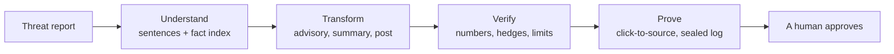
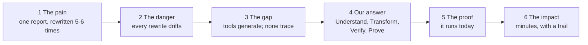
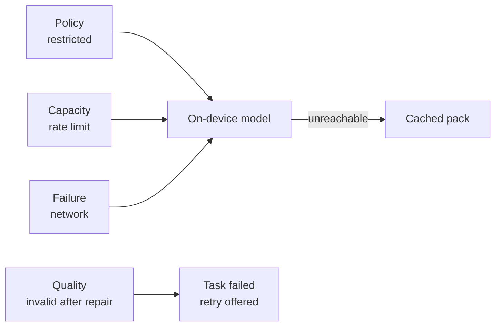

# SIH26154 — Deck & Narrative Guide (Person A)

Sep 25, 2026 · @Shahil Khan

The deck is the submission, due Sep 30, 2026. Your job is to make a jury believe, in the few minutes they give each entry, that this team understands the problem better than anyone else in the room — and has already built the proof.

The Final SRS is the source of every technical claim you make. If a sentence on a slide is not supported by the SRS or by something the team measured, it does not go on the slide.

## 1. Your job, deliverables and four days

You are not the team's scribe. You own the argument: what the problem is, why this solution is different, and what proves it. You also hold a veto on scope — if something cannot be shown, it does not need building this week.

| Deliverable | For | Due |
|----|----|----|
| The idea-submission deck, in the official template | The SIH portal | Submit Tue 29; Wed 30 is buffer |
| A demo video of at most two minutes, if links are allowed | The portal | Mon 28 |
| The jury Q&A sheet | The whole team rehearses from it | Mon 28 |
| An architecture note of at most two pages, if the PS asks for one | The finale | Draft in Phase 2 |
| The GitHub repository: pushed, team invited, `main` protected | The whole team | Fri 25, before hour zero (Step 10) |
| The README's product sections, above the developer sections already there | The repository | Phase 2 |

| Day | Work | Done means |
|----|----|----|
| **Fri 25** | Push the repo and invite the team before hour zero (Step 10). Verify the format (Step 0). Read Steps 1 and 2. Write every slide's text (Step 3). List the Blueprint deck's fixes (Step 4) | Every slide has final wording, and no claim on any slide is unsupported |
| **Sat 26** | Build the figures (Step 5). Write the Q&A sheet (Step 7). Script the video with C (Step 6) | Figures done; Q&A sheet first draft; video script agreed |
| **Sun 27** | Collect screenshots from C, the network-monitor capture from B, measured numbers from D. Run a Q&A drill with the team | Assets in; the deck is complete except for the video link |
| **Mon 28** | Record and edit the video. Final deck. Timed dry run | Deck and video final; every member has answered the Q&A sheet aloud once |
| **Tue 29** | Submit. Screenshot the confirmation | Submitted a day early |

**Submit on Tuesday, not Wednesday.** Portals slow down on deadline day, and a day of buffer costs nothing. After submission you join B on security and integration for the finale build.

## Step 0 — Verify the submission format today

Every hour spent on slides before this check is at risk. Do it first, from the official sources only — not from this guide, the analysis document, or any other secondary write-up.

- [ ] Download the official idea-submission template from the SIH portal. Use it exactly; never reorder or rename mandated sections.
- [ ] Record the slide limit, the file format (PPTX or PDF) and the size limit.
- [ ] Check whether a video link is allowed, how long it may be, and where it must be hosted.
- [ ] Open the SIH26154 problem statement page and note any deliverables it lists itself. The analysis document claimed "architecture document of at most 2 pages, demo of at most 2 minutes, presentation of at most 5 slides" — confirm or discard that against the page.
- [ ] Note the deadline time in IST, and whose account submits.
- [ ] Ask the institute's SIH coordinator whether the college has an earlier internal deadline.

**If the template's structure differs from Step 3.** In recent editions the idea template has run roughly: title, proposed solution, technical approach, feasibility and viability, impact and benefits, research and references. Step 3 is written for that order. If 2026 differs, move each content block into its matching slot — the content stays the same; only its position changes.

**If the portal and the PS page disagree,** ask the coordinator before choosing. Do not guess on the one document that is actually graded.

## Step 1 — The system in ten minutes

You must be able to explain the system to a judge without notes. Here it is in plain words.

An analyst has one threat report. Leadership needs a one-page summary, the sector CERT needs an advisory, the public needs a LinkedIn post. Today someone rewrites the report by hand, five or six times, and every rewrite can quietly change a fact. Our system does the rewriting in about a minute — and, which is the point, it can show where every sentence it wrote came from.



| Word | What happens | What a judge sees |
|----|----|----|
| **Understand** | The report is split into numbered sentences. One model call builds an index of the facts — severity, actors, systems, indicators, recommendations — and every fact points to the sentences it came from | The extracted-facts panel |
| **Transform** | Every format is written from that one index, never from the raw report, so severity, numbers and names cannot differ between formats | Three cards filling in, each on its own |
| **Verify** | Code, not a model, checks every sentence: are its numbers in the source sentence it cites? If the source said *possible*, does the output still say so? Is it within the length limit? If anything fails, one targeted repair | *1 fix* on a card, and exactly what was fixed |
| **Prove** | Click any sentence and its source passage lights up. Every action goes into a log where each entry seals the one before it | The yellow highlight; the tamper check |

**Sovereignty.** Material marked *restricted* is processed on the laptop's own model. The server refuses to send it anywhere, and a network monitor beside the running system stays silent. Material marked *internal* goes to the cloud with IP addresses, domains and names masked.

**The four beats.** Every slide and every answer ties back to one of these (SRS §12).

| Beat | The question it answers | The proof |
|----|----|----|
| Provenance | *Is it making things up?* | Click a sentence; its source lights up |
| Consistency | *Isn't this just five separate prompts?* | One fact index feeds every format |
| Sovereignty | *Where does our data go?* | A silent network monitor during a restricted run |
| Verification | *What if it gets a number wrong?* | The injected error, caught and repaired on screen |

## Step 2 — The narrative spine

**The one sentence.** Put it on the solution slide and say it at the end of the video, word for word:

> Our platform converts trusted source intelligence into controlled, audience-specific artefacts while preserving factual integrity and a verifiable transformation trail.

**The short form**, for the title slide: *One trusted source. Many verified artefacts. Every sentence traceable.*

**The story, in six moves.**



**The two examples are the heart of the deck.** Architecture explains what was built; these explain why it had to exist. A judge feels them in four seconds. Use them verbatim.

> Source: *"The organisation observed indicators consistent with a possible phishing campaign."*
>
> Rewrite: *"The organisation was attacked by a phishing campaign."*

Fluent, more confident — and the evidence has silently changed. No spell-check, style guide or quick human read catches it. Our hedge check does.

> Source: *"37 organisations were potentially exposed."*
>
> Rewrite: *"42 organisations were exposed."*

It cites the right sentence and still gets the number wrong, and drops the hedge too. A grounding score alone would call it perfect. Our verifier catches both errors and repairs only that sentence.

**The "it's just an LLM wrapper" answer**, which the whole deck exists to support: the model is one component. The engineering is the pipeline around it — a single fact index, deterministic verification, one capped repair, classification-enforced routing, and a sealed log. Swap the model and every one of those still holds.

**What judges score, and where the deck answers it.**

| Criterion | Their question | Where it is answered |
|----|----|----|
| Innovation | Is this more than an LLM wrapper? | Solution slide: the four words and the two examples |
| Feasibility | Does the workflow actually run? | Feasibility slide: screenshots and measured numbers |
| Security | How are sensitive inputs protected? | Technical slide: the sovereignty boundary |
| Relevance | Why does NTRO need this? | Solution and impact slides |
| Completeness | A product, or a prompt demo? | The video, and the build plan |

## Step 3 — Slide by slide

Six slides, in the order recent templates use. Wording in quotation marks goes on the slide as written. Figure codes such as F1 refer to Step 5. Numbers in square brackets are placeholders for D's measurements — if a number was not measured, delete the sentence rather than estimate it.

### Slide 1 — Title

- The template's fields: PS ID **SIH26154**, *Gen AI Platform for Automated Content Transformation*, organisation **NTRO**, theme **Blockchain & Cybersecurity**, team name, team ID, institute.

- Product name: **Intelligent Content Transformation Engine**, the team's own name from the Blueprint deck.

- Tagline: "One trusted source. Many verified artefacts. Every sentence traceable."

- Visual: the Blueprint cover art. It is good; keep it.

### Slide 2 — Proposed solution

**Headline:** "We don't just generate content. We transform intelligence without losing its integrity."

**Left, the problem:**

- "One report is rewritten by hand five or six times — for leadership, sector CERTs and the public."

- "Every rewrite can drift: *consistent with a possible phishing campaign* becomes *was attacked by a phishing campaign*."

- "Today's AI tools write fluent text. None can show where a sentence came from."

**Right, the solution:** F1, the four-word pipeline, one line under each word.

**Box, what is new:**

- "Every sentence is clickable back to the passage it came from."

- "The system checks its own output in code, and repairs the specific error."

- "Restricted material never leaves the machine — enforced by the server, not a setting."

*Speaker notes:* "An analyst writes one report; five audiences need it in five shapes. Rewriting by hand is slow, and each rewrite can quietly change what the evidence says — *possible* becomes *confirmed*. Our system does the rewriting, and unlike any AI writing tool, it can show you the source of every sentence it wrote."

### Slide 3 — Technical approach

**Headline:** "An orchestrated pipeline around the model — not a prompt."

**Visual:** F2, the corrected architecture, with C's provenance screenshot as an inset.

**Body:**

- "One fact index per source; every format is written from it — so severity, numbers and names match across all artefacts."

- "A deterministic verifier checks every sentence's numbers, identifiers and hedges against the sentence it cites. One targeted repair; never a loop."

- "Classification-tiered routing: public to the cloud, internal to the cloud with identifiers masked, restricted to the on-device model only — enforced server-side before any provider is chosen."

- "A sealed audit log: each entry carries the hash of the one before it, so a changed record is detected."

**Footer:** "TypeScript end to end — React, Express, BullMQ, PostgreSQL, Redis · Gemini in the cloud · Ollama on the device."

*Speaker notes:* "The model is one component. Around it is a pipeline: understand the source once, write every format from the same facts, check every sentence in code, and prove it. Routing decisions are made by code, not by a model, because in intelligence work the document itself can be hostile."

### Slide 4 — Feasibility and viability

**Headline:** "It runs today: three formats generated, verified and traced from one source."

**Measured** (D's numbers only): "\[n\] seconds for three formats on the cloud model. \[n\] seconds on the laptop's own model. Average grounding \[x\] across \[n\] runs."

**Screenshots:** C's #3 (live cards), #5 (the repair) and #6 (restricted run beside a silent network monitor).

**Risks and mitigations:**

| Risk | How it is handled |
|----|----|
| The model states something false | Every number and hedge is checked against the cited sentence; a human approves before release |
| The network or provider fails on the day | The on-device model takes over, then a cached pack; the demo runs on a laptop hotspot |
| A document tries to instruct the model | Source text is treated as data; control flow is code; injected text surfaces as unverified |
| Scope grows faster than the build | Five formats in the MVP; two stretch formats locked behind acceptance tests |

**Next:** "X thread and video package, Hindi output, the review workflow, containerised deployment."

*Speaker notes:* "This is not a mock-up. These screens are the running prototype. The error on screen was injected deliberately to show the verifier — and it caught it."

### Slide 5 — Impact and benefits

**Headline:** "From a working day to minutes — with a trail an auditor can check."

| For NTRO and NCIIPC | For security | For growth |
|----|----|----|
| Analyst hours returned; faster dissemination to sector CISOs; one consistent message on every channel | Sensitive content stays on-premise by policy; every artefact traces to its source; tampering with the log is detected | A new format is one registry entry; Hindi is a setting, not a new pipeline |

**Footer:** "Target: five artefacts from a 3,000-word source in under 60 seconds." Keep the word *target* unless D measured it.

### Slide 6 — Research and references

- Problem statement SIH26154, National Technical Research Organisation.

- NIST AI 600-1, *Generative AI Profile* of the AI Risk Management Framework — the risk framing.

- OWASP Top 10 for LLM Applications — prompt injection, the first risk on its list.

- C2PA specification — content provenance, the roadmap anchor for the audit log.

- Adjacent products: Adobe GenStudio, Canva Magic Write, ChatGPT. They generate; none traces a sentence to its source.

- Tools: Gemini API, Ollama, BullMQ, PostgreSQL, Redis.

Open each reference yourself before citing it, and use the title exactly as the source gives it.

**If the cap is five slides,** fold the references into a footer line on slide 5. If the template allows, carry the title fields as a header strip on slide 2 and give the freed slide to the screenshots.

## Step 4 — Fixing the Blueprint deck

The *Resilient Intelligence Blueprint* deck looks like an engineering document rather than a pitch, and that will land. It is not in the official template, so it is not the submission. Its visuals are, though: the architecture tiers, the sovereignty boundary and the fallback matrix go into slides 2 and 3 once the errors below are fixed. Each error is one a security-literate judge will find.

| Slide | It says | Why that is a problem | Replace with |
|----|----|----|----|
| 4 | "Restricted data **physically** cannot cross the cloud egress arrow" | The same box says *evaluated server-side*. It is a software check; *physically* invites "physically how?" | "Enforced server-side in the worker, before any provider is chosen. A restricted task that reaches the cloud adapter is refused." |
| 5 | QUALITY (schema invalid twice) arrows into LOCAL MODEL | A quality failure is terminal and never reroutes (SRS §9.1); rerouting would hide a bug behind a fallback | Draw QUALITY to its own box, *Task failed, retry offered*, labelled *never rerouted* |
| 2 | IMAGE CONTEXT among the inputs | Image ingestion is out of scope (SRS §1); a judge can ask to see it | Remove the icon. Four inputs remain |
| 2 | "100% JSON-enforced" | An overclaim: invalid output gets one repair, then the card fails | "Schema-validated, with one targeted repair" |
| 4 | Tailscale WireGuard inside the sovereignty matrix | Tailscale controls who reaches the gateway, not what leaves the server | Move it to slide 3, beside the gateway: "Device access: Tailscale (ingress only)" |
| 3 | FastAPI in tier 2; Celery in tier 3 | The stack is TypeScript (SRS §7) | Express in tier 2; BullMQ in tier 3 |
| 3 | Tier 5: Workers, MCP Server, AI Engine | The MCP server is a Phase 2 item. Claim it only once it exists | "Workers, verifier, AI engine" |
| 5 | "System collapses into FastAPI background tasks. The system will not fail to start." | An internal contingency, and it reads as defensive | Delete it. Keep the venue-strategy sentence above it, which is excellent |

**What the Blueprint deck lacks entirely:** any view of the product, the two examples, the provenance interaction and the verification catch. Those come from Steps 2 and 5.

## Step 5 — Figures and assets

Six figures carry the deck. Draw F1 to F5 in one tool — draw.io or Excalidraw — in the Blueprint style: navy on grid paper, one orange accent, text no smaller than 18 point. F6 is a screenshot with one annotation.

| Code | Figure | Slide | Source |
|----|----|----|----|
| F1 | The four-word pipeline | 2 | Sketch below |
| F2 | Architecture tiers, corrected | 3 | Blueprint slide 3 plus Step 4's fixes |
| F3 | Sovereignty boundary, corrected wording | 3 | Blueprint slide 4 plus Step 4's fixes |
| F4 | Fallback matrix, corrected | 4, or Q&A backup | Diagram below |
| F5 | The two examples, before and after | 2 | Step 2 |
| F6 | The provenance screenshot, arrow from sentence to source | 3 | C's screenshot #4 |

**F1, the four-word pipeline.**

```text
[ Threat report ] --> UNDERSTAND --> TRANSFORM --> VERIFY --> PROVE --> [ Approved ]
                      sentences +    each format   numbers,    click to
                      fact index     written from  hedges,     source;
                                     one index     limits      sealed log
```

**F4, the fallback matrix as it must be redrawn.** Three conditions reroute; the fourth stops.



**F5, the two examples.** Two before-and-after cards side by side. On the first, show *consistent with a possible* struck out and *was attacked by* in red. On the second, show *37* turning into *42* and *potentially* disappearing. Caption: *"Fluent. Confident. Wrong. Our verifier catches both."*

**The asset schedule.** Chase these by name; a missing screenshot on Sunday night is a slide you cannot finish.

| Asset | From | Due |
|----|----|----|
| Team name, team ID, institute details | The team lead | Fri 25 |
| Six screenshots (Frontend Guide, Step 8) | C | Sun 27, evening |
| Network-monitor capture during a restricted run | B | Sun 27, evening |
| The audit-tamper command and its result | B | Sun 27 |
| Measured numbers table, and the exact model names | D | Sun 27, evening |

**Where assets live.** Keep the deck's sources in the repository, so nothing exists only on one laptop the night before submission:

```text
docs/deck/
  figures/        F1–F5 sources (.drawio or .excalidraw) and their PNG exports
  screenshots/    C's six screenshots, B's network-monitor capture
  numbers.md      D's measured numbers table and the exact model names, as sent
  SIH26154-deck.pptx   the final deck only, not every draft
```

Screenshots arrive in teammates' pull requests, since every PR that changes a screen carries one, or in the team chat; copy the ones you use into `docs/deck/screenshots/`. Keep the video out of git: host it where the portal says, and put its link in `numbers.md`.

## Step 6 — The two-minute video

One story, not fifteen features. Every shot proves one of the four beats. The voiceover is about 260 words, which fits two minutes at a calm pace with room for the visuals to breathe.

| Time | On screen | Voiceover |
|----|----|----|
| 0:00–0:10 | Title card with the tagline | "An analyst writes one threat report. Five audiences need it. Rewriting it by hand takes a day — and every rewrite can quietly change the facts." |
| 0:10–0:25 | Ingest: the demo report pasted, *Internal* selected, its consequence readable | "We paste a report and mark it Internal, so identifiers are masked before anything reaches the cloud." |
| 0:25–0:40 | Confirm: the extracted-facts panel beside the source | "First, the system builds one index of the facts — severity high, actor TC-7, 37 organisations — and every fact points back to its sentence." |
| 0:40–0:50 | Configure: senior officials, formal; three formats; LinkedIn tone set to conversational; Generate | "One source, three formats. The LinkedIn post gets its own tone." |
| 0:50–1:05 | Workspace: cards filling independently; one shows *Repairing* | "Each format is written from the same index, and checked before anyone sees it." |
| 1:05–1:20 | A LinkedIn sentence clicked; its source passage lights up | "Every sentence is traceable. Click it, and its source lights up." |
| 1:20–1:35 | The verification badge expanded | "Here we injected a fault: the draft said 42 organisations. The verifier checked the sentence it cited — which says 37 — caught it, and repaired only that sentence." |
| 1:35–1:52 | A restricted run beside the network monitor, sped up and labelled *×4* | "Restricted material runs on this laptop's own model. The server refuses to send it out, and the network monitor stays silent." |
| 1:52–2:00 | Closing card: Understand, Transform, Verify, Prove | "We don't just generate content. We transform intelligence without losing its integrity." |

**Recording.**

1.  Record each row as its own clip, at 1920×1080, with OBS Studio or the Windows Game Bar (Win+Alt+R). Projector mode on (Frontend Guide, Step 8).

2.  Rehearse each clip first. Use the demo source only — the cached pack and D's tests are built around it.

3.  Record the voiceover separately, in a quiet room. Edit clips and voice together in Clipchamp, which ships with Windows 11.

4.  Label any sped-up footage on screen. Hidden speed-ups are the kind of claim a judge remembers against you.

5.  **Say "injected" out loud in the 1:20 shot.** Passing an injected fault off as a natural error would make the video exactly what the product exists to catch (SRS §9.5).

6.  Upload unlisted wherever the portal allows, then open the link from a signed-out browser to check that it plays.

## Step 7 — The jury Q&A sheet

Every answer is short, specific and true. Each question has one owner who answers first; anyone may add one sentence after. On Sunday, the team lead reads questions at random and the owner answers aloud in under 30 seconds. Numbers in square brackets come from D's measurements.

| # | Question | Answer | Owner |
|----|----|----|----|
| 1 | *Isn't this just an LLM wrapper?* | The model is one component. Around it: one fact index per source, every format written from it, a verifier in code that checks every number and hedge against the sentence it cites, one targeted repair, classification-enforced routing and a sealed log. Swap the model and all of that still holds. | A |
| 2 | *How do you prevent hallucinations? Can you guarantee none?* | No generative system should promise zero. We reduce and detect: formats are written only from extracted facts, every sentence carries its source, code checks numbers and hedges, unsupported sentences are marked unverified, and a human approves before release. | D |
| 3 | *What happens to confidential government information?* | Three tiers. Restricted never leaves the machine: a local model, enforced on the server before any provider is chosen. Internal goes to the cloud with IPs, domains and names masked. Public goes directly. | B |
| 4 | *Why blockchain? Why not just a database?* | We did not bolt on a chain. The audit log is hash-linked, so changing any past entry is detected, and we can show it. A permissioned ledger or C2PA manifest is the path when an outside party must verify without trusting our database. | B |
| 4a | *Can't someone just delete the newest rows?* | Yes. Detecting that needs the latest hash published somewhere outside the operator's control — that is our roadmap step. | B |
| 5 | *Is it agentic?* | It plans a batch, fans it out, checks its own output and repairs specific failures — an agentic loop. The control decisions are deliberately code: in intelligence work the document can be hostile, and a model that picks the next step can be steered by what it reads. | D |
| 6 | *What if the model changes a number?* | Show it: the draft cited the right sentence but said 42 where the source says 37. The verifier compares against the cited sentence, flags it, and repairs only that sentence. Never more than two model calls per artefact. | D |
| 7 | *What about prompt injection hidden in a document?* | The source is delimited data, never the system prompt; output must fit a schema; the orchestrator is code, so a document cannot redirect it. Injected text that reaches the output has no valid citation and shows as unverified. We test it with a planted instruction. | D |
| 8 | *Why not ChatGPT, Adobe GenStudio or Canva?* | They prove the market for AI writing. We focus on trusted transformation in a security workflow: one set of facts across formats, sentence-level provenance, classification-aware routing and an audit trail. Those are first-class here and absent there. | A |
| 9 | *What if the internet fails?* | The on-device model takes over. If that is down too, a cached pack for the known source is served, and labelled as such. We present from a laptop hotspot, not venue wifi. | B |
| 10 | *How good is the local model?* | Weaker and slower than the cloud model: \[n\] seconds per format on our laptop. Its output passes through the same verifier, so its mistakes are caught the same way. | D |
| 11 | *How does this scale?* | A new format is one registry entry. Language is a parameter: the same facts in Hindi, identifiers kept in English. Throughput grows by adding workers to the queue. | D |
| 12 | *What did you actually build?* | Built: \[exactly what runs on submission day\]. Planned for the finale: \[the Phase 2 list\]. Never blur the two. | A |
| 13 | *Why TypeScript for an AI project?* | The model is an API call. The hard parts are orchestration, verification and streaming, where one language and shared types across frontend and backend remove a class of bugs. Nothing here trains a model. | B |
| 14 | *How do you measure quality?* | Grounding score per artefact, the share of drafts that needed a repair, and findings left after repair, measured on our test set: \[numbers\]. | D |
| 15 | *Is this real NTRO data?* | No. It is a clearly labelled synthetic incident report, built to exercise every check. We would never present synthetic data as operational. | A |

## Step 8 — Words to use and words to avoid

A security jury listens for overclaims. One wrong word on a slide costs more credibility than a missing feature. Search the final deck for every word in the left column before submitting.

| Avoid | Why | Say instead |
|----|----|----|
| "Physically cannot" | It is a software check | "Enforced server-side before any provider is chosen" |
| "100%", "guaranteed", "zero hallucination" | Unprovable, and it invites a counter-example | "Checked against the source, one targeted repair, human approval" |
| "Blockchain-powered", "on the blockchain" | No chain runs in this system | "Hash-linked audit log; ledger anchoring on the roadmap" |
| "Military-grade", "unhackable" | Meaningless, and provocative to this audience | Name the control: "classification-enforced routing" |
| "Our AI understands" | Invites "how?" | "The model extracts the facts; code verifies them" |
| "Fully autonomous agents" | Untrue, and a security red flag here | "An orchestrated pipeline; control flow in code" |
| "Real-time" | Not measured | "About \[n\] seconds for three formats" |
| "NTRO data", "real intelligence" | The sample is synthetic | "A synthetic incident report" |
| "Supports images and video input" | Out of scope | "Text, PDF and DOCX sources" |
| "Zero-latency" | Corrected in the SRS | "Minutes instead of a working day" |
| "MCP-based", until the server exists | A Phase 2 item | Leave it out; if asked, "the tools are shaped for MCP" |
| "Our model" | The team uses hosted and open models | Name them: the exact model names D reports |

**Words that earn trust:** *traceable, verified against the source, enforced server-side, tamper-evident, targeted repair, on-device, synthetic sample, measured, target.*

## Step 9 — Architecture note, README and the final checklist

### The architecture note — at most two pages, only if the PS asks for it

Draft it in Phase 2 from the SRS; every section below maps to one SRS section, so nothing new needs inventing.

| Part | Content | From |
|----|----|----|
| Problem and approach | Three sentences, ending with the one-sentence pitch | SRS §1 |
| Architecture | Figure F2, with one sentence per tier | SRS §7 |
| The pipeline | The four-word table from Step 1 | SRS §5, §9 |
| Security model | The three tiers, the egress gate, injection controls, the sealed log | SRS §5.6, §5.7, §8 |
| Resilience | Figure F4, the cached pack, the hotspot | SRS §9.1, §13 |
| Limits and roadmap | Tail deletion needs an external anchor; no OCR; date normalisation next | SRS §1, §8, §9.5 |

### The README — Phase 2, at the repo root

A developer README already exists at the repo root: layout, quick start, commands, the pull-request workflow, CI, troubleshooting, the data note and the owners table. Keep all of it. In Phase 2, add the product sections **above** it, so a judge who opens the repository reads the product first and the setup second:

1.  One line on what it is, the tagline, and screenshot #4, from `docs/deck/screenshots/`.

2.  The demo, as four numbered beats with the exact clicks.

3.  The architecture figure F2, and a link to the Final SRS.

4.  Measured numbers from `docs/deck/numbers.md`, each labelled *measured* or *target*.

The quick start, the team table and the data note are already there; check they are still true, rather than writing them again.

### Before you press Submit

- [ ] The official template is used, with its mandated sections in their order
- [ ] Slide 1 has the correct PS ID, title, theme, team name and team ID
- [ ] Every number on a slide is in D's table, or is labelled *target*
- [ ] The words-to-avoid search from Step 8 finds nothing
- [ ] Every reused Blueprint visual carries the Step 4 fixes
- [ ] Both examples are on the solution slide
- [ ] The provenance screenshot is in the deck
- [ ] Screenshot #5 is captioned *fault injected for demonstration*, and the video says *injected* aloud
- [ ] The video is under two minutes and plays from a signed-out browser
- [ ] The file is under the portal's size limit; for a PDF, fonts are embedded
- [ ] Two teammates have proof-read the deck
- [ ] Submitted on Tuesday, with a screenshot of the confirmation saved

## Step 10 — The repository: setup, reviews and your own pull requests

The team works in one Turborepo monorepo. The README at its root is the manual: layout, commands and the pull-request workflow. You have three jobs in it: set it up once, review what the deck will quote, and put your own work through the same pull requests as everyone else.

### Once, before hour zero on Friday

The README's *One-time GitHub setup* section has every click; in order:

- [ ] On the laptop holding the repository, set your own name and email for this repository, so the first commit is yours: `git config user.name "Your Name"` and `git config user.email "<your GitHub email>"`
- [ ] Commit the scaffold, create an empty private repository on GitHub, and push
- [ ] Invite B, C and D with *Write* access, and send them the link
- [ ] Add a ruleset for `main`: pull request with one approval, the CI check **typecheck, test, build** passing, no force pushes. On a private repository GitHub enforces this only on a paid plan; GitHub Pro is free with the Student Developer Pack. Without it, keep the rule by agreement
- [ ] Put the four GitHub usernames into `.github/CODEOWNERS` and uncomment the lines, in your first pull request

### Reviews that are yours

You are not a code reviewer, but some pull requests change words the deck and the video quote. Ask to be added as a reviewer on these, and check them against Step 8's words to avoid:

| PR changes | Why you check it |
| --- | --- |
| C's classification wording, badges, card labels | They are read aloud in the demo and appear in screenshots |
| D's finding `detail` text | Screenshot #5 shows it on a slide |
| Anything in `docs/final/` | The SRS and the guides are the team's contract |
| The README | The first page a judge sees |

### Your own pull requests

Nobody pushes to `main`, you included. Your work goes in `docs/`:

```bash
git switch main
git pull
git switch -c docs/deck-figures           # docs/<what>: docs/qa-sheet, docs/readme, docs/guide-fix
# ...add files under docs/deck/, or edit a guide...
npm run docs:html                          # only after editing a guide or the SRS: rebuilds its .html copy
git add docs
git commit -m "docs: figures F1 to F5, sources and exports"
git push -u origin docs/deck-figures
```

Then, on GitHub, press *Compare & pull request* and fill in the template. The code checks do not apply to you, so say what you checked instead: the HTML opens and its diagrams render, the links work, every number is in D's table. CI still runs `npm run check` and must pass; a docs-only change cannot break it.

**Editing the SRS or a guide.** It is the contract everyone builds from, so post in the team chat before the pull request, and ask the owner of the affected guide to review. `npm run docs:html` needs [pandoc](https://pandoc.org); commit the `.md` and the rebuilt `.html` together, so they never disagree.

**Binary files.** Commit the final deck and final figure exports, not every draft: git keeps every version of a binary forever. Never commit the video, a real report, or anything from the portal that carries personal data.
