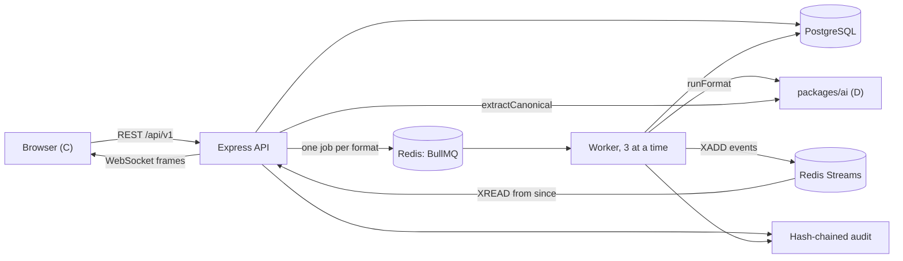
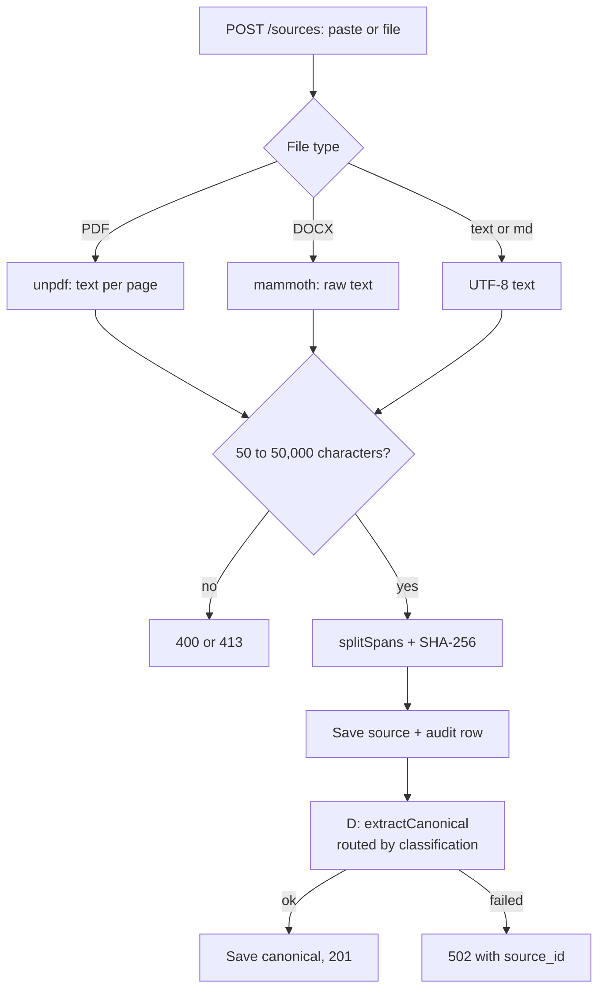
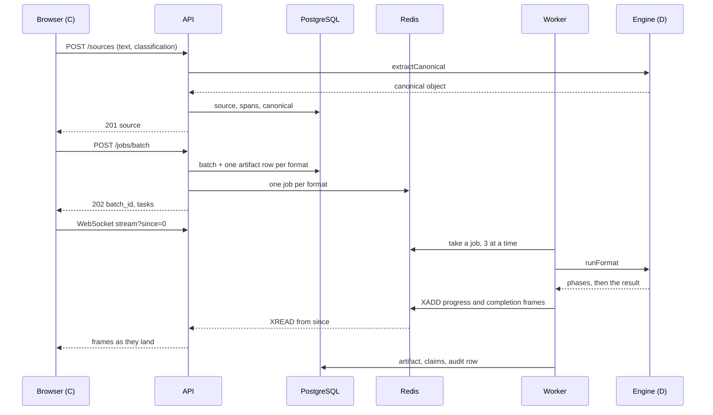
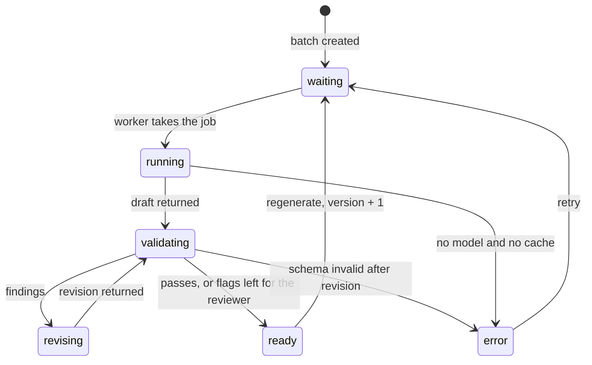
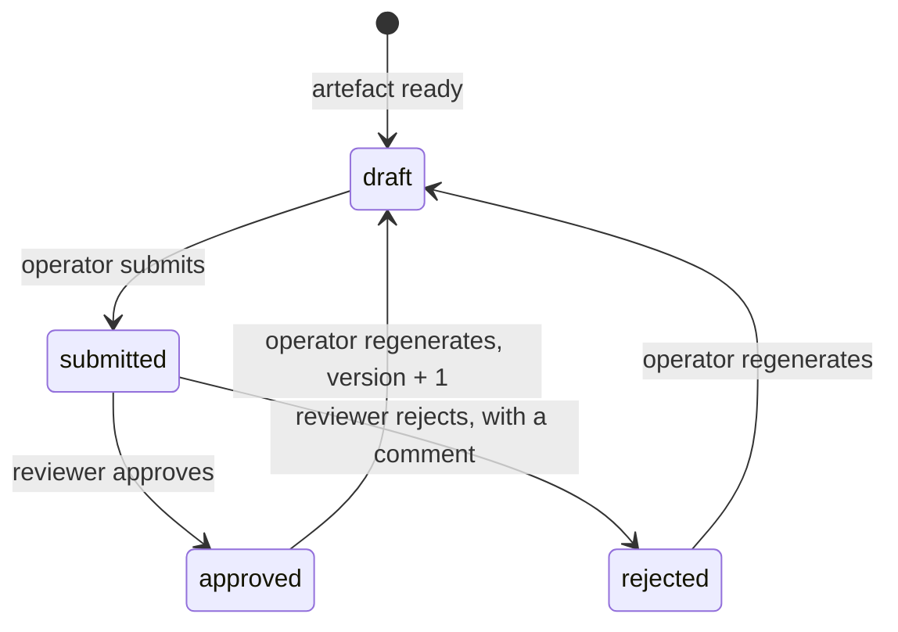
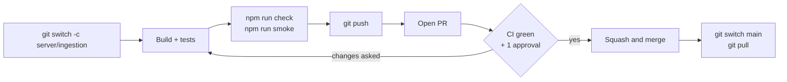

# SIH26154 — Backend Guide (Person B)

Sep 25, 2026 · @Shahil Khan

You own the spine: `apps/server`, `prisma/` and the repo's root configuration. By Sunday 27 September, a pasted source must become three artefact cards that fill in live over a WebSocket, with every state change written to a hash-chained audit log.

The Final SRS is the contract; this guide is the build order. Where they disagree, the SRS wins and you tell the team.

## 1. Your job and your finish line

You build everything that moves data: the API the browser talks to, the queue that fans work out, the worker that calls D's engine, the stream that pushes progress to C, and the log that proves what happened.



Two processes run from one package: `npm run dev:api` serves HTTP and WebSockets, `npm run dev:worker` does the generation. They share the database, Redis and the audit module.

### What you own

| Piece | Where | SRS |
| --- | --- | --- |
| Root config: workspaces, Turborepo tasks, Docker services, `.env.example`, CI. Already scaffolded; you maintain it | repo root, `.github/` | §13 |
| API and event schemas, `splitSpans` | `packages/shared/src/` — `api.ts`, `events.ts`, `spans.ts`, `index.ts` | §5.1, §10 |
| Database | `prisma/schema.prisma`, `prisma/seed.ts`, `prisma/append-only.sql` | §8 |
| API server: auth, sources, batches, tasks, audit, stream | `apps/server/src/` — `api.ts`, `routes/`, `stream.ts` | §10 |
| Worker | `apps/server/src/worker.ts` | §7, §9.1 |
| Audit chain | `apps/server/src/audit.ts` | §8 |
| Exports and the cached pack | `apps/server/src/export.ts`, `apps/server/scripts/seed-pack.ts` | §10.1, NFR-7 |
| Tests and the smoke run | `apps/server/test/`, `packages/shared/test/`, `apps/server/scripts/smoke.ts` | §12 |

### The acceptance criteria you answer for

| AC | You prove | Due |
| --- | --- | --- |
| AC-1 | One source becomes every selected format within 60 seconds, none erroring | Sun 27, three formats |
| AC-5 | With D: a restricted source makes zero outbound calls | Sun 27 |
| AC-7 | A 20-page PDF ingests and generates like pasted text | Sun 27 |
| AC-9 | One format fails; the others still show; the batch reads `partial` | Sun 27 |
| AC-11 | A per-format override is recorded in that artefact's `effective_config` | Sat 26 |
| AC-13 | The socket drops mid-run, reconnects, and no card is stranded | Sun 27 |
| AC-14 | A tampered audit row is detected and named | Sun 27 |
| AC-6, AC-8, AC-10 | Review workflow, full fallback chain, no self-approval | Phase 2 |

### What you hand over, and when

| To | What | When |
| --- | --- | --- |
| Everyone | Your half of `packages/shared` — API and event schemas, `splitSpans` — merged to `main` | Fri 25, hour zero |
| C | A running API: login, ingest the demo source, create a batch, stream frames | Sat 26, evening |
| D | A worker that calls `runFormat` with real sources | Sat 26, afternoon |
| A | The audit-tamper demo command, and a screenshot of a network monitor during a restricted run | Sun 27 |

## 2. Your four days

Each day ends at a gate. If a gate slips, cut scope from the next day, never from the gate.

| Day | Build | Done means |
| --- | --- | --- |
| **Fri 25** | Setup (Step 0). Hour zero with the team: everyone running from the repo, the shared contract merged (Step 1). Database (Step 2). Express app and auth (Step 3) | `docker compose up -d`, `npm run dev:api`, and a login from C's screen returns a token |
| **Sat 26** | Ingestion (Step 4). Batches (Step 5). Worker (Step 6), on a stub engine until D's is ready at noon | The demo source, pasted, produces three artefact rows that reach `ready` in PostgreSQL |
| **Sun 27** | Stream (Step 7). Audit chain (Step 8). Cached pack and network-off rehearsal (Step 10) | C's cards fill live; AC-13 reconnect and AC-14 tamper both pass; a restricted run is recorded with a network monitor open |
| **Mon 28** | Freeze. Review workflow (Step 9) only if everything above is solid | The demo runs three times in a row without anyone touching code |

- [ ] Friday gate
- [ ] Saturday gate
- [ ] Sunday gate
- [ ] Monday gate

**A gate counts only once it is on `main`.** Work on a branch, test it (Step 11) and merge it through a pull request (Step 12). Aim for one PR per step: small PRs get reviewed within the hour, while a whole day's work in one PR does not get reviewed at all.

**Never wait for D.** Until D's engine lands on Saturday, the worker calls a stub that sleeps three seconds, emits the three phases, and returns one of D's mock results from `apps/web/src/mocks/`. Queue, stream and cards all get built against the stub; switching to the real engine is a one-line import change.

## Step 0 — Set up your machine

Install before the hour-zero meeting, so the meeting is spent on the repo, not on downloads.

1. **Node 22 LTS.** Check with `node -v`; 20.12 or later works.
2. **Docker Desktop.** On Windows, enable the WSL 2 backend. Check with `docker compose version`.
3. **Git**, and a **GitHub account** with access to the team repository (A sends the invitation). `main` is protected: nobody pushes to it directly, you included. All work arrives through pull requests (Step 12).
4. **A database viewer** — DBeaver, pgAdmin or the VS Code PostgreSQL extension. You will look at rows constantly on Saturday.
5. **A REST client** — VS Code's Thunder Client, Postman, or `curl`. On Windows PowerShell, type `curl.exe`, because plain `curl` is an alias for a different command there.

PostgreSQL and Redis run in Docker; nothing else needs installing. You never run a database on the host.

## Step 1 — Hour zero: the repo and the shared contract

You drive the first two hours on Friday with all four present. The monorepo already exists — Turborepo over npm workspaces, every dependency in this guide installed, CI on every pull request — so hour zero has two jobs: get every machine running from it, and merge the shared contract.

**Everyone, on their own machine.** Git Bash works as written; PowerShell differs only where a comment says so.

```bash
git clone <repo-url> ps154 && cd ps154
npm install              # every workspace, one lockfile
cp .env.example .env     # PowerShell: Copy-Item .env.example .env
docker compose up -d     # PostgreSQL and Redis; C and D may skip this until Saturday
npm run check            # typecheck, test, build: green on a fresh clone
npm run dev              # web on :5173, placeholder API on :8080, placeholder worker
```

A placeholder page at `http://localhost:5173` means that machine is ready. If `docker compose up -d` or `db:push` later complains about a port or a password, a PostgreSQL or Redis already installed on that laptop holds the port; the troubleshooting table has the two-line fix.

**The layout.** One folder, one owner; only `packages/shared` changes by agreement.

```text
ps154/
  package.json            workspaces + every run script            B
  turbo.json              task graph: dev, typecheck, test, build  B
  tsconfig.base.json      compiler settings every package extends  B
  docker-compose.yml      PostgreSQL + Redis                       B
  .env.example            every variable, no secrets               B
  .github/                CI, pull request template, CODEOWNERS    B
  prisma/                 schema, seed, append-only trigger        B
  packages/shared/src/    Zod schemas: the contract                all four
  packages/ai/            the engine                               D
  apps/server/            API + worker                             B
  apps/web/               React client                             C
  samples/                demo and test sources                    D
  docs/                   the SRS, these guides, deck assets       A
```

**Already in the repo — read it, do not rewrite it.**

| File | What it does | You change it when |
| --- | --- | --- |
| `package.json` (root) | npm workspaces and every script. Turborepo runs the per-package tasks — `dev`, `dev:api`, `dev:worker`, `typecheck`, `test`, `build`; one-off scripts — `db:*`, `seed:pack`, `smoke`, `try` — run from the root, as before | You add a root script |
| `turbo.json` | Which tasks exist, what they depend on, what is cached. `envMode: loose`, so a shell variable such as `DEMO_PERTURB=1` still reaches every task | You add a new kind of task |
| `tsconfig.base.json` | Strict TypeScript with `Bundler` resolution. Each package's `tsconfig.json` extends it; `apps/server/tsconfig.json` also covers `prisma/*.ts` | Rarely |
| `apps/server/package.json` | Every dependency this guide uses, installed. `dev:api` and `dev:worker` run `tsx watch --env-file=../../.env`, so the root `.env` is found although Turborepo starts them inside `apps/server` | You add a dependency |
| `apps/server/vitest.config.ts` | Loads the root `.env`, falling back to `.env.example`, before any test runs | Rarely |
| `apps/server/src/api.ts`, `worker.ts` | Placeholders, so `npm run dev` works on day zero | You replace them in Steps 3 and 6 |
| `apps/server/scripts/smoke.ts` | The end-to-end check in Step 11 | Your API changes shape |
| `docker-compose.yml`, `.env.example` | As SRS §13, plus `PG_PORT` and `REDIS_PORT` for laptops where 5432 or 6379 is taken | You add a service or a variable |
| `scripts/postinstall.mjs` | Runs `prisma generate` after every `npm install` once `prisma/schema.prisma` exists, so no teammate meets a missing Prisma client | Never |
| `.github/workflows/ci.yml` | On every pull request: `npm ci`, then `npm run check`, on Linux | A new check must gate merging |

**Adding a dependency.** From the root: `npm i <package> -w @ps154/server`. Never run a bare `npm i` inside `apps/server`; it would create a second lockfile.

**Prisma is pinned to 6.** Prisma 7 changed how the client is generated; mixing instructions from both versions costs an afternoon. `bcryptjs` is pure JavaScript, which avoids native build tools on Windows.

`"moduleResolution": "Bundler"` lets every file import `./claim` without a `.js` extension, and `tsx` runs TypeScript directly, so the server has no build step anywhere in Phase 1.

**Your half of the contract.** D writes `claim.ts`, `canonical.ts`, `config.ts`, `formats.ts` and `verification.ts` in the same session (Guide D, Step 1); you write the four files below. Easiest in the room: D types theirs on your laptop, on the same branch.

**`packages/shared/src/api.ts`** — request and response shapes (SRS §3 envelope, §10).

```ts
import { z } from 'zod';
import { Classification, Config, ConfigOverrides } from './config';
import { FormatId } from './formats';
import { Claim, Span } from './claim';
import { Canonical } from './canonical';
import { Verification } from './verification';

export const LoginRequest = z.object({ name: z.string(), password: z.string() });
export const PasteSource = z.object({ text: z.string(), classification: Classification });

export const SourceRecord = z.object({
  id: z.string(), filename: z.string().nullable(), mime_type: z.string(),
  raw_content: z.string(), classification: Classification, spans: z.array(Span),
  canonical: Canonical.nullable(), source_hash: z.string(), created_at: z.string(),
});
export type SourceRecord = z.infer<typeof SourceRecord>;

export const BatchRequest = z.object({
  source_id: z.string().uuid(),
  global_config: Config,
  formats: z.array(z.object({ format_id: FormatId, overrides: ConfigOverrides.optional() }))
    .min(1).max(6),
}).refine((b) => new Set(b.formats.map((f) => f.format_id)).size === b.formats.length,
          { message: 'duplicate format_id' });
export type BatchRequest = z.infer<typeof BatchRequest>;

export const TaskStatus = z.enum(['waiting', 'running', 'validating', 'revising', 'ready', 'error']);
export const ReviewState = z.enum(['draft', 'submitted', 'approved', 'rejected']);
export const OverallStatus = z.enum(['queued', 'running', 'complete', 'partial', 'failed']);

export const ArtifactMeta = z.object({
  provider: z.enum(['cloud', 'local', 'cache']), model: z.string(),
  fallback_reason: z.enum(['policy', 'rate_limit', 'network']).nullable(),
  attempts: z.number(), latency_ms: z.number(), perturbed: z.boolean(),
});

export const Artifact = z.object({
  task_id: z.string(), batch_id: z.string(), format_id: FormatId,
  effective_config: Config, content: z.unknown().nullable(), claims: z.array(Claim),
  grounding_score: z.number().nullable(), verification: Verification.nullable(),
  meta: ArtifactMeta.nullable(), status: TaskStatus, review_state: ReviewState,
  review_comment: z.string().nullable(), error_log: z.string().nullable(), version: z.number(),
});
export type Artifact = z.infer<typeof Artifact>;

export const BatchCreated = z.object({
  batch_id: z.string(), stream_last_id: z.string(),
  tasks: z.array(z.object({ task_id: z.string(), format_id: FormatId, status: TaskStatus })),
});
export type BatchCreated = z.infer<typeof BatchCreated>;

export const BatchSnapshot = z.object({
  batch_id: z.string(), source_id: z.string(), global_config: Config,
  overall_status: OverallStatus, stream_last_id: z.string(), artifacts: z.array(Artifact),
});
export type BatchSnapshot = z.infer<typeof BatchSnapshot>;
```

**`packages/shared/src/events.ts`** — WebSocket frames (SRS §10.3). `seq` is the Redis Stream entry id.

```ts
import { z } from 'zod';
import { Artifact, TaskStatus } from './api';

export const Frame = z.discriminatedUnion('event', [
  z.object({ event: z.literal('task.progress'), seq: z.string(), task_id: z.string(),
             status: TaskStatus, detail: z.string().optional() }),
  z.object({ event: z.literal('task.completed'), seq: z.string(), task_id: z.string(),
             artifact: Artifact }),
  z.object({ event: z.literal('task.failed'), seq: z.string(), task_id: z.string(),
             error_code: z.string(), message: z.string(), retryable: z.boolean() }),
  z.object({ event: z.literal('batch.completed'), seq: z.string(), batch_id: z.string(),
             overall_status: z.enum(['complete', 'partial', 'failed']),
             completed: z.number(), failed: z.number() }),
]);
export type Frame = z.infer<typeof Frame>;

/** A frame before the stream assigns its seq. */
type DistributiveOmit<T, K extends keyof any> = T extends unknown ? Omit<T, K> : never;
export type FrameBody = DistributiveOmit<Frame, 'seq'>;
```

**`packages/shared/src/spans.ts`** — sentence spans (SRS §5.1), used by your ingestion and by D's test harness.

```ts
import type { Span } from './claim';

/** Split text into sentence spans. Pass `pages` for PDFs: the text must be pages.join('\n\n'). */
export function splitSpans(text: string, pages?: string[]): Span[] {
  const starts: number[] = [];
  if (pages) {
    let offset = 0;
    for (const p of pages) { starts.push(offset); offset += p.length + 2; }
  }
  const pageOf = (offset: number) => {
    let i = starts.length - 1;
    while (i > 0 && starts[i] > offset) i--;
    return i + 1;
  };
  // Line breaks always end a sentence, so headings and list items become their own spans.
  const segmenter = new Intl.Segmenter(undefined, { granularity: 'sentence' });
  const spans: Span[] = [];
  for (const { segment, index } of segmenter.segment(text)) {
    const body = segment.trim();
    if (body.length < 2) continue;
    const start = index + (segment.length - segment.trimStart().length);
    spans.push({
      span_id: `span_${spans.length + 1}`, text: body,
      start_offset: start, end_offset: start + body.length,
      ...(pages ? { page: pageOf(start) } : {}),
    });
  }
  return spans;
}
```

**`packages/shared/src/index.ts`**

```ts
export * from './config';
export * from './claim';
export * from './canonical';
export * from './formats';
export * from './verification';
export * from './api';
export * from './events';
export * from './spans';
```

`index.ts` replaces the placeholder of the same name.

**Merge it before anyone leaves the room.** All nine shared files, plus the two shared tests from Step 11, go in one pull request:

```bash
git switch -c shared/hour-zero-contract
# ...write the files, add packages/shared/test/spans.test.ts and api.test.ts from Step 11...
npm run check
git add packages/shared
git commit -m "shared: hour-zero contract - claims, canonical, formats, API, frames, spans"
git push -u origin shared/hour-zero-contract
```

Open the pull request (Step 12); D approves your files and you approve D's. C reads all nine, because every screen builds on them. Once it merges, all four run `git switch main` and `git pull`. Every other member's first task depends on this merge. From then on, a change to `packages/shared` needs a message in the team chat first, because C's mocks and your database depend on the exact shapes.

## Step 2 — The database

The schema below is SRS §8 in Prisma form; the diagram and the reason for every field are there. Field names are snake\_case, so a row read from PostgreSQL already has the shape the Zod schemas describe — no mapping layer anywhere.

**`prisma/schema.prisma`**

```prisma
generator client {
  provider = "prisma-client-js"
}

datasource db {
  provider = "postgresql"
  url      = env("DATABASE_URL")
}

model User {
  id            String     @id @default(uuid())
  name          String     @unique
  role          String     // operator | reviewer | admin
  password_hash String
  batches       BatchJob[]
  @@map("users")
}

model Source {
  id             String     @id @default(uuid())
  filename       String?
  mime_type      String
  raw_content    String
  classification String     // public | internal | restricted
  spans          Json
  canonical      Json?
  source_hash    String
  metadata       Json       @default("{}")
  created_by     String
  created_at     DateTime   @default(now())
  purge_after    DateTime?
  batches        BatchJob[]
  @@map("sources")
}

model BatchJob {
  batch_id       String     @id @default(uuid())
  source_id      String
  source         Source     @relation(fields: [source_id], references: [id])
  created_by     String
  creator        User       @relation(fields: [created_by], references: [id])
  global_config  Json
  overall_status String     @default("queued")
  created_at     DateTime   @default(now())
  completed_at   DateTime?
  artifacts      Artifact[]
  @@map("batch_jobs")
}

model Artifact {
  task_id          String   @id @default(uuid())
  batch_id         String
  batch            BatchJob @relation(fields: [batch_id], references: [batch_id])
  format_id        String
  effective_config Json
  content          Json?
  grounding_score  Float?
  verification     Json?
  meta             Json?
  status           String   @default("waiting")
  review_state     String   @default("draft")
  review_comment   String?
  reviewed_by      String?
  error_log        String?
  version          Int      @default(1)
  updated_at       DateTime @updatedAt
  claims           Claim[]
  @@map("artifacts")
}

model Claim {
  id          String   @id @default(uuid())
  task_id     String
  artifact    Artifact @relation(fields: [task_id], references: [task_id], onDelete: Cascade)
  claim_key   String   // "c3": the id C sees inside content
  text        String
  source_refs Json
  status      String   // fact | inference | framing
  grounded    Boolean
  @@map("claims")
}

model AuditLog {
  id        String   @id @default(uuid())
  seq       Int      @unique
  actor_id  String?
  target_id String?
  action    String
  metadata  Json     @default("{}")
  ts        DateTime
  prev_hash String
  row_hash  String
  @@map("audit_log")
}
```

**`prisma/append-only.sql`** — NFR-11: the database itself refuses to edit history.

```sql
CREATE OR REPLACE FUNCTION audit_append_only() RETURNS trigger AS $$
BEGIN
  RAISE EXCEPTION 'audit_log is append-only';
END;
$$ LANGUAGE plpgsql;

DROP TRIGGER IF EXISTS audit_append_only ON audit_log;
CREATE TRIGGER audit_append_only BEFORE UPDATE OR DELETE ON audit_log
  FOR EACH ROW EXECUTE FUNCTION audit_append_only();
```

The trigger and the hash chain in Step 8 are two layers. The trigger stops casual edits. A database superuser can disable it — and the chain catches exactly that. The demo shows both.

**`prisma/seed.ts`** — one user per role. Share these with the team, and with no one else.

```ts
import 'dotenv/config';
import { PrismaClient } from '@prisma/client';
import bcrypt from 'bcryptjs';

const prisma = new PrismaClient();
for (const [name, role] of [['operator', 'operator'], ['reviewer', 'reviewer'], ['admin', 'admin']]) {
  await prisma.user.upsert({
    where: { name }, update: {},
    create: { name, role, password_hash: await bcrypt.hash('demo1234', 10) },
  });
}
console.log('Seeded operator, reviewer and admin. Password: demo1234');
await prisma.$disconnect();
```

**Run it.**

```bash
npm run db:push      # creates the tables from the schema
npm run db:trigger   # makes audit_log append-only
npm run db:seed      # three users
```

`db push` also generates the Prisma client. Teammates get it automatically: once your schema is on `main`, their next `npm install` runs `prisma generate` for them. A PR that changes the schema says so in its description, so everyone reruns `npm run db:push` after pulling it.

`db push` is the right tool for Phase 1: it syncs the schema without migration files. Switch to `prisma migrate dev` once the schema stops changing, so the finale laptop can be rebuilt from history. If you ever reset the database, run `db:trigger` again — a push does not recreate it.

## Step 3 — The Express app, auth and roles

Express 5 passes a rejected promise from any async handler to the error middleware, so no route needs its own try/catch. Role checks happen on the server for every route (NFR-9); the client hiding a button is never the enforcement.

**`apps/server/src/env.ts`**

```ts
import 'dotenv/config';
import { z } from 'zod';

export const env = z.object({
  DATABASE_URL: z.string().min(1),
  REDIS_URL: z.string().min(1),
  JWT_SECRET: z.string().min(16, 'JWT_SECRET must be at least 16 characters'),
  PORT: z.coerce.number().default(8080),
  WEB_ORIGIN: z.string().default('http://localhost:5173'),
}).parse(process.env);
```

**`apps/server/src/db.ts`**

```ts
import { PrismaClient } from '@prisma/client';
import { Redis } from 'ioredis';
import { env } from './env';

export const prisma = new PrismaClient();
// BullMQ requires maxRetriesPerRequest: null on every connection its workers use.
export const redis = new Redis(env.REDIS_URL, { maxRetriesPerRequest: null });
```

**`apps/server/src/auth.ts`**

```ts
import { Router, type Request, type Response, type NextFunction } from 'express';
import jwt from 'jsonwebtoken';
import bcrypt from 'bcryptjs';
import { LoginRequest } from '@ps154/shared';
import { prisma } from './db';
import { env } from './env';

export type Role = 'operator' | 'reviewer' | 'admin';
export interface AuthUser { id: string; name: string; role: Role }
declare global { namespace Express { interface Request { user?: AuthUser } } }

export const authRouter = Router();

authRouter.post('/login', async (req, res) => {
  const { name, password } = LoginRequest.parse(req.body);
  const user = await prisma.user.findUnique({ where: { name } });
  if (!user || !(await bcrypt.compare(password, user.password_hash))) {
    res.status(401).json({ error: 'Invalid name or password' });
    return;
  }
  const payload: AuthUser = { id: user.id, name: user.name, role: user.role as Role };
  res.json({ token: jwt.sign(payload, env.JWT_SECRET, { expiresIn: '12h' }), user: payload });
});

export function verifyToken(token?: string | null): AuthUser | null {
  if (!token) return null;
  try { return jwt.verify(token, env.JWT_SECRET) as AuthUser; } catch { return null; }
}

export function requireUser(req: Request, res: Response, next: NextFunction) {
  const user = verifyToken(req.headers.authorization?.replace(/^Bearer /, ''));
  if (!user) { res.status(401).json({ error: 'Sign in required' }); return; }
  req.user = user;
  next();
}

export const requireRole = (...roles: Role[]) =>
  (req: Request, res: Response, next: NextFunction) => {
    if (req.user && roles.includes(req.user.role)) return next();
    res.status(403).json({ error: 'Your role cannot do this' });
  };
```

**`apps/server/src/engine.ts`** — the Friday version is a stub, so ingestion, the worker and the stream never wait for D.

```ts
// Replace this whole file with the two lines at the bottom once D's engine is in.
const sleep = (ms: number) => new Promise((r) => setTimeout(r, ms));
const claim = { id: 'c1', text: 'Stub fact from the source.', source_refs: ['span_1'],
                status: 'fact' as const, grounded: true };

export const engine = {
  async extractCanonical(_source: unknown) {
    return {
      canonical: { title: 'Stub source', severity: { value: 'high', source_refs: ['span_1'] },
        entities: [], events: [], affected_systems: [], indicators: [],
        key_facts: [{ text: 'Stub fact', status: 'fact', source_refs: ['span_1'] }],
        recommendations: [] },
      meta: { provider: 'local', model: 'stub' },
    };
  },
  // The index signature accepts the source, canonical and config the worker passes (Step 6).
  async runFormat({ formatId, onPhase }: { formatId: string; [input: string]: unknown;
      onPhase?: (s: 'running' | 'validating' | 'revising', d?: string) => unknown }) {
    await onPhase?.('running'); await sleep(2000);
    await onPhase?.('validating'); await sleep(500);
    return {
      content: { headline: `Stub ${formatId}`, key_points: [claim, claim, claim],
                 impact: [claim], decisions_required: [claim] },
      claims: [claim], grounding_score: 1,
      verification: { passed: true, revised: false, fixes: [], open_issues: [] },
      meta: { provider: 'local' as const, model: 'stub', fallback_reason: null,
              attempts: 1, latency_ms: 2500, perturbed: false },
    };
  },
};

// The real version, from Saturday noon:
// import { createEngine } from '@ps154/ai';
// import { redis } from './db';
// export const engine = createEngine({ redis });
```

**`apps/server/src/api.ts`** — add each router line as you build its step.

```ts
import { createServer } from 'node:http';
import express, { type ErrorRequestHandler } from 'express';
import cors from 'cors';
import { ZodError } from 'zod';
import { env } from './env';
import { authRouter, requireUser } from './auth';
import { sourcesRouter } from './routes/sources';
import { jobsRouter } from './routes/jobs';
import { tasksRouter } from './routes/tasks';
import { auditRouter } from './routes/audit';
import { attachStream } from './stream';

const app = express();
app.use(cors({ origin: env.WEB_ORIGIN }));
app.use(express.json({ limit: '2mb' }));

app.get('/health', (_req, res) => { res.json({ ok: true }); });
app.use('/api/v1/auth', authRouter);
app.use('/api/v1', requireUser); // every route below needs a signed-in user
app.use('/api/v1/sources', sourcesRouter);
app.use('/api/v1/jobs', jobsRouter);
app.use('/api/v1/tasks', tasksRouter);
app.use('/api/v1/audit', auditRouter);

const onError: ErrorRequestHandler = (err, _req, res, _next) => {
  if (err instanceof ZodError) {
    res.status(400).json({ error: 'Invalid request', issues: err.issues });
    return;
  }
  const status = err.status ?? 500;
  if (status >= 500) console.error(err);
  res.status(status).json({ error: err.message ?? 'Server error' });
};
app.use(onError);

const server = createServer(app);
attachStream(server);
server.listen(env.PORT, () => console.log(`API on http://localhost:${env.PORT}`));
```

Once D's engine is in, add `GET /api/v1/formats` returning `formatsList` from `@ps154/ai`, so C's format picker reads from the registry instead of a hard-coded list.

**Friday's gate test.** Start the API with `npm run dev:api`, then send this with your REST client:

```http
POST http://localhost:8080/api/v1/auth/login
Content-Type: application/json

{ "name": "operator", "password": "demo1234" }
```

A JSON body with a `token` means C can log in tonight.

## Step 4 — Ingestion

`POST /api/v1/sources` turns a paste or a file into stored text, sentence spans and the canonical object. Extraction runs inside the request: the operator waits 5 to 40 seconds behind a spinner, which is acceptable for Phase 1 and needs no extra queue.



**Add to `apps/server/src/db.ts`** — Prisma's JSON type rejects optional fields such as `page`; this helper keeps the casts in one place.

```ts
import { Prisma } from '@prisma/client';
export const json = (v: unknown) => v as Prisma.InputJsonValue;
```

**Create `apps/server/src/audit.ts` now as a placeholder.** Step 8 replaces it; until then every call site already exists.

```ts
export async function appendAudit(..._args: unknown[]) {}
```

**`apps/server/src/routes/sources.ts`**

```ts
import { Router, type Request } from 'express';
import multer from 'multer';
import { createHash } from 'node:crypto';
import { extractText, getDocumentProxy } from 'unpdf';
import mammoth from 'mammoth';
import { Classification, splitSpans } from '@ps154/shared';
import { prisma, json } from '../db';
import { engine } from '../engine';
import { appendAudit } from '../audit';
import { requireRole } from '../auth';

const upload = multer({ storage: multer.memoryStorage(), limits: { fileSize: 10 * 1024 * 1024 } });
const DOCX = 'application/vnd.openxmlformats-officedocument.wordprocessingml.document';
export const sourcesRouter = Router();

// A paste arrives as JSON, a file as multipart with a "file" field. Multer ignores JSON.
sourcesRouter.post('/', requireRole('operator'), upload.single('file'), async (req, res) => {
  const classification = Classification.parse(req.body.classification);
  const input = await readInput(req);
  if (input.text.trim().length < 50) {
    res.status(400).json({ error: 'The source is too short to transform.' }); return;
  }
  if (input.text.length > 50_000) {
    res.status(413).json({ error: 'Sources are limited to 50,000 characters.' }); return;
  }

  const spans = splitSpans(input.text, input.pages);
  const source_hash = createHash('sha256').update(input.text).digest('hex');
  const source = await prisma.source.create({ data: {
    filename: input.filename, mime_type: input.mime, raw_content: input.text, classification,
    spans: json(spans), source_hash, created_by: req.user!.id,
    purge_after: new Date(Date.now() + 30 * 24 * 3600 * 1000), // SRS §5.8
  } });
  await appendAudit(req.user!.id, source.id, 'source.ingested',
                    { classification, source_hash, spans: spans.length });

  try {
    const { canonical, meta } = await engine.extractCanonical({
      id: source.id, classification, spans, raw_content: input.text, source_hash });
    const saved = await prisma.source.update({ where: { id: source.id },
                                               data: { canonical: json(canonical) } });
    await appendAudit(req.user!.id, source.id, 'source.extracted', meta);
    res.status(201).json(saved);
  } catch (e: any) {
    res.status(502).json({ error: `Fact extraction failed: ${e.message}`, source_id: source.id });
  }
});

sourcesRouter.get('/:id', async (req, res) => {
  const source = await prisma.source.findUnique({ where: { id: req.params.id } });
  if (!source) { res.status(404).json({ error: 'Source not found' }); return; }
  res.json(source);
});

async function readInput(req: Request) {
  const f = req.file;
  if (!f) {
    return { text: String(req.body.text ?? '').replace(/\r\n?/g, '\n'), mime: 'text/plain', filename: null, pages: undefined };
  }
  const name = f.originalname.toLowerCase();
  if (f.mimetype === 'application/pdf' || name.endsWith('.pdf')) {
    const pdf = await getDocumentProxy(new Uint8Array(f.buffer));
    const { text } = await extractText(pdf, { mergePages: false }); // one string per page
    const pages = (text as string[]).map((p) => p.trim());
    return { text: pages.join('\n\n'), pages, mime: 'application/pdf', filename: f.originalname };
  }
  if (f.mimetype === DOCX || name.endsWith('.docx')) {
    const { value } = await mammoth.extractRawText({ buffer: f.buffer });
    return { text: value, mime: DOCX, filename: f.originalname, pages: undefined };
  }
  if (f.mimetype.startsWith('text/') || name.endsWith('.md') || name.endsWith('.txt')) {
    return { text: f.buffer.toString('utf8').replace(/\r\n?/g, '\n'), mime: 'text/plain', filename: f.originalname,
             pages: undefined };
  }
  throw Object.assign(new Error('Unsupported file type. Use PDF, DOCX, TXT or MD.'), { status: 415 });
}
```

The page texts are trimmed before joining, and `splitSpans` receives exactly those pages, so every span's page number matches its offset.

**Test it** with the demo source D writes on Friday. On Windows, `curl.exe` sends the file without any JSON quoting:

```bash
curl.exe -X POST http://localhost:8080/api/v1/sources -H "Authorization: Bearer <token>" -F "classification=public" -F "file=@samples/demo-incident.md"
```

Check the `sources` row: `spans` holds about 25 sentences, each with correct offsets, and `canonical` is filled. Then upload any PDF of 20 pages or more (AC-7) and confirm the spans carry `page`.

**Phase 2.** Move extraction into a BullMQ job with a `canonical_status` column, so the confirmation screen can show spans instantly and the facts panel fills in when ready.

## Step 5 — Batches

`POST /api/v1/jobs/batch` answers `202` in milliseconds, before any generation starts, so C paints skeleton cards immediately (SRS §10.4). The slow work happens in the worker. This is the whole request lifecycle, end to end:



**`apps/server/src/queue.ts`**

```ts
import { Queue } from 'bullmq';
import { redis } from './db';

export const generateQueue = new Queue('generate', { connection: redis });

export const enqueueTask = (task_id: string, version: number) =>
  generateQueue.add('generate', { task_id }, {
    jobId: `${task_id}-v${version}`, // one job per version; avoid ':' in custom ids
    attempts: 1,                     // retries and fallback live in the engine, not in the queue
    removeOnComplete: 1000,
    removeOnFail: 1000,
  });
```

**`apps/server/src/artifact.ts`** — turns a database row into the envelope from SRS §3.

```ts
import type { Artifact } from '@ps154/shared';

export function toArtifact(a: any): Artifact {
  return {
    task_id: a.task_id, batch_id: a.batch_id, format_id: a.format_id,
    effective_config: a.effective_config, content: a.content ?? null,
    claims: (a.claims ?? []).map((c: any) => ({ id: c.claim_key, text: c.text,
      source_refs: c.source_refs, status: c.status, grounded: c.grounded })),
    grounding_score: a.grounding_score, verification: a.verification ?? null, meta: a.meta ?? null,
    status: a.status, review_state: a.review_state, review_comment: a.review_comment,
    // The stored log holds a stack trace; the client only ever sees its first line.
    error_log: a.error_log ? String(a.error_log).split('\n')[0] : null,
    version: a.version,
  };
}
```

**`apps/server/src/routes/jobs.ts`**

```ts
import { Router } from 'express';
import { BatchRequest } from '@ps154/shared';
import { prisma, redis, json } from '../db';
import { enqueueTask } from '../queue';
import { appendAudit } from '../audit';
import { requireRole } from '../auth';
import { toArtifact } from '../artifact';

export const jobsRouter = Router();

jobsRouter.post('/batch', requireRole('operator'), async (req, res) => {
  const body = BatchRequest.parse(req.body); // 1 to 6 formats, no duplicates
  const source = await prisma.source.findUnique({ where: { id: body.source_id } });
  if (!source || source.created_by !== req.user!.id) {
    res.status(404).json({ error: 'Source not found' }); return;
  }
  if (!source.canonical) {
    res.status(409).json({ error: 'Facts have not been extracted from this source yet' }); return;
  }

  const batch = await prisma.batchJob.create({
    data: {
      source_id: source.id, created_by: req.user!.id,
      global_config: json(body.global_config), overall_status: 'running',
      artifacts: { create: body.formats.map((f) => ({
        format_id: f.format_id,
        effective_config: json({ ...body.global_config, ...f.overrides }), // FR-11: merged per format
      })) },
    },
    include: { artifacts: true },
  });
  for (const a of batch.artifacts) await enqueueTask(a.task_id, a.version);
  await appendAudit(req.user!.id, batch.batch_id, 'batch.created', {
    formats: body.formats.map((f) => f.format_id),
    overridden: body.formats.filter((f) => f.overrides).map((f) => f.format_id),
  });

  res.status(202).json({
    batch_id: batch.batch_id, stream_last_id: '0',
    tasks: batch.artifacts.map((a) => ({ task_id: a.task_id, format_id: a.format_id, status: a.status })),
  });
});

jobsRouter.get('/:batch_id', async (req, res) => {
  // Read the stream position FIRST, then the rows. A frame landing in between
  // is replayed to the client rather than lost.
  const last = await redis.xrevrange(`stream:${req.params.batch_id}`, '+', '-', 'COUNT', 1);
  const batch = await prisma.batchJob.findUnique({
    where: { batch_id: req.params.batch_id },
    include: { artifacts: { include: { claims: true }, orderBy: { format_id: 'asc' } } },
  });
  if (!batch) { res.status(404).json({ error: 'Batch not found' }); return; }
  res.json({
    batch_id: batch.batch_id, source_id: batch.source_id, global_config: batch.global_config,
    overall_status: batch.overall_status, stream_last_id: last[0]?.[0] ?? '0',
    artifacts: batch.artifacts.map(toArtifact),
  });
});
```

**Test AC-11 here.** Send a batch with a LinkedIn override of `"tone": "conversational"` while the global tone is formal. That artefact's `effective_config` row must say conversational; the others must say formal.

## Step 6 — The worker

The worker takes one job per artefact, three at a time (NFR-4), and drives it through its states. Each state change is written to PostgreSQL and emitted to the batch's stream, so the database and the screen always agree.



The orchestration here is deterministic code, never a model deciding the next step — SRS §7 explains why that is a security property, not just a simplification.

**`apps/server/src/events.ts`**

```ts
import type { FrameBody } from '@ps154/shared';
import { redis } from './db';

export async function emit(batch_id: string, frame: FrameBody) {
  const key = `stream:${batch_id}`;
  await redis.xadd(key, 'MAXLEN', '~', '1000', '*', 'frame', JSON.stringify(frame));
  await redis.expire(key, 6 * 3600); // SRS §8: streams live six hours
}
```

**`apps/server/src/batch-status.ts`**

```ts
import { prisma } from './db';
import { emit } from './events';

export async function refreshBatchStatus(batch_id: string) {
  const rows = await prisma.artifact.findMany({ where: { batch_id }, select: { status: true } });
  const done = rows.filter((r) => r.status === 'ready').length;
  const failed = rows.filter((r) => r.status === 'error').length;
  if (done + failed < rows.length) return; // still running
  const overall_status = failed === 0 ? 'complete' : done === 0 ? 'failed' : 'partial';
  await prisma.batchJob.update({ where: { batch_id }, data: { overall_status, completed_at: new Date() } });
  await emit(batch_id, { event: 'batch.completed', batch_id, overall_status, completed: done, failed });
}
```

`partial` is the normal outcome when one format fails, not an error state (SRS §10.4).

**`apps/server/src/worker.ts`**

```ts
import { Worker } from 'bullmq';
import type { Canonical, Classification, Config, FormatId, Span } from '@ps154/shared';
import { prisma, redis, json } from './db';
import { engine } from './engine';
import { emit } from './events';
import { appendAudit } from './audit';
import { refreshBatchStatus } from './batch-status';
import { toArtifact } from './artifact';

async function setStatus(batch_id: string, task_id: string, status: string, detail?: string) {
  await prisma.artifact.update({ where: { task_id }, data: { status } });
  await emit(batch_id, { event: 'task.progress', task_id, status: status as any,
                         ...(detail ? { detail } : {}) });
}

const worker = new Worker('generate', async (job) => {
  const { task_id } = job.data as { task_id: string };
  const lock = `lock:task:${task_id}`;
  // A stalled job can be re-delivered while its first run is still going. The lock makes that harmless.
  if (!(await redis.set(lock, String(job.id), 'EX', 300, 'NX'))) return;

  const task = await prisma.artifact.findUniqueOrThrow({
    where: { task_id }, include: { batch: { include: { source: true } } } });
  const { batch } = task;
  const { source } = batch;
  try {
    const result = await engine.runFormat({
      formatId: task.format_id as FormatId,
      source: { id: source.id, classification: source.classification as Classification,
                spans: source.spans as unknown as Span[], raw_content: source.raw_content,
                source_hash: source.source_hash },
      canonical: source.canonical as unknown as Canonical,
      config: task.effective_config as unknown as Config,
      onPhase: (status, detail) => setStatus(batch.batch_id, task_id, status, detail),
    });
    const saved = await prisma.artifact.update({
      where: { task_id },
      data: {
        status: 'ready', content: json(result.content), grounding_score: result.grounding_score,
        verification: json(result.verification), meta: json(result.meta), error_log: null,
        claims: { deleteMany: {}, create: result.claims.map((c) => ({
          claim_key: c.id, text: c.text, source_refs: json(c.source_refs),
          status: c.status, grounded: c.grounded })) },
      },
      include: { claims: true },
    });
    await emit(batch.batch_id, { event: 'task.completed', task_id, artifact: toArtifact(saved) });
    await appendAudit(batch.created_by, task_id, 'artifact.generated', {
      format_id: task.format_id, version: task.version, grounding_score: result.grounding_score,
      provider: result.meta.provider, model: result.meta.model,
      fallback_reason: result.meta.fallback_reason,
      revised: result.verification.revised, perturbed: result.meta.perturbed });
  } catch (e: any) {
    const kind = e?.constructor?.name;
    if (kind === 'EgressBlocked') console.error('EGRESS BLOCKED: restricted content reached the cloud adapter', e);
    const code = e?.code ?? (kind === 'TransportError' ? 'PROVIDERS_UNAVAILABLE' : 'GENERATION_FAILED');
    await prisma.artifact.update({ where: { task_id },
                                   data: { status: 'error', error_log: String(e?.stack ?? e) } });
    await emit(batch.batch_id, { event: 'task.failed', task_id, error_code: code,
                                 message: e?.message ?? 'Generation failed', retryable: true });
    await appendAudit(batch.created_by, task_id, 'artifact.failed', { format_id: task.format_id, code });
  } finally {
    await redis.del(lock);
    await refreshBatchStatus(batch.batch_id);
  }
}, { connection: redis, concurrency: 3 }); // NFR-4: three in flight

worker.on('ready', () => console.log('Worker ready: 3 concurrent tasks'));
```

**Saturday's gate test.** Run `npm run dev:worker` beside the API, ingest the demo source, and post a batch of three formats. Watch the `artifacts` rows move `waiting → running → validating → ready` in your database viewer. With the stub engine it takes about three seconds per card; with D's engine, 10 to 30.

**Test AC-9 on Sunday.** Temporarily make the stub throw for one format. That card ends in `error`, the other two in `ready`, and the batch in `partial`.

## Step 7 — The WebSocket stream

The worker writes frames into a Redis Stream; the API reads them and forwards them to the browser. Because a Stream keeps its entries, a client that drops and reconnects asks for everything after the last frame it saw, and misses nothing (SRS §8, AC-13). Pub/Sub would drop those frames silently.

```text
socket 1   since=0    e1  e2  e3  x  (Wi-Fi blips)
socket 2   since=e3                   e4  e5  e6
                                      nothing lost, nothing repeated
```

**`apps/server/src/stream.ts`**

```ts
import type { Server } from 'node:http';
import { WebSocketServer, WebSocket } from 'ws';
import { redis } from './db';
import { verifyToken } from './auth';

const PATH = /^\/api\/v1\/jobs\/([\w-]+)\/stream$/;

export function attachStream(server: Server) {
  const wss = new WebSocketServer({ noServer: true });
  server.on('upgrade', (req, socket, head) => {
    const url = new URL(req.url ?? '/', 'http://localhost');
    const match = url.pathname.match(PATH);
    // Browsers cannot set headers on a WebSocket, so the token travels in the query string.
    const user = verifyToken(url.searchParams.get('token'));
    if (!match || !user) { socket.destroy(); return; }
    wss.handleUpgrade(req, socket, head, (ws) =>
      pump(ws, match[1], url.searchParams.get('since') || '0'));
  });
}

/** Forward every stream entry after `since` to this socket until it closes. */
async function pump(ws: WebSocket, batch_id: string, since: string) {
  const reader = redis.duplicate(); // XREAD BLOCK holds its connection: never share it
  let open = true;
  ws.on('close', () => { open = false; reader.disconnect(); });
  let last = since;
  while (open) {
    const res = await reader
      .xread('BLOCK', 15000, 'STREAMS', `stream:${batch_id}`, last)
      .catch(() => null);
    if (!res) continue; // 15 s with no frames, or the socket closed
    for (const [, entries] of res) {
      for (const [id, fields] of entries) {
        last = id;
        if (ws.readyState !== WebSocket.OPEN) return;
        ws.send(JSON.stringify({ ...JSON.parse(fields[1]), seq: id }));
      }
    }
  }
}
```

Each connection gets its own Redis connection because `XREAD BLOCK` parks it for up to 15 seconds. Sharing one would freeze every other command in the API.

**How C uses it.** C fetches `GET /jobs/{id}`, renders the snapshot, then opens `ws://…/api/v1/jobs/{id}/stream?since={stream_last_id}&token={jwt}`. On every frame C stores `seq`; on reconnect it passes the last one as `since`.

**Test AC-13 with C on Sunday.** Start a three-format batch. Once the first card is ready, set Chrome DevTools → Network to *Offline* for five seconds, then back. Every card must still reach its final state, and no frame may be applied twice. `npm run smoke` (Step 11) repeats the server half of this check on every run: it drops its socket mid-batch and resumes from the last `seq`.

**Phase 2.** Check that the batch belongs to the caller, or that the caller is a reviewer, before streaming. Batch ids are random UUIDs, so this is defence in depth rather than an open hole.

## Step 8 — The hash-chained audit log

Every audit row stores the hash of the row before it, so changing any past row breaks every hash after it (SRS §8). This is how the project answers the theme's *blockchain* half honestly: tamper-evidence in about forty lines, with no chain network to run.

```text
row 1: prev = 000...0   row_hash = H1 = sha256(prev, seq, actor, target, action, metadata, ts)
row 2: prev = H1        row_hash = H2
row 3: prev = H2        row_hash = H3   <- edit row 3 and H3 no longer matches; row 4's prev = H3 fails too
```

**`apps/server/src/audit.ts`** — replaces Saturday's placeholder.

```ts
import { createHash } from 'node:crypto';
import { prisma } from './db';

const GENESIS = '0'.repeat(64);

/** JSON with sorted keys, so the same data always hashes to the same value. */
function stable(v: unknown): string {
  if (Array.isArray(v)) return `[${v.map(stable).join(',')}]`;
  if (v && typeof v === 'object') {
    return `{${Object.keys(v).sort()
      .map((k) => `${JSON.stringify(k)}:${stable((v as any)[k])}`).join(',')}}`;
  }
  return JSON.stringify(v ?? null);
}

interface Row { seq: number; prev_hash: string; actor_id: string | null; target_id: string | null;
                action: string; metadata: unknown; ts: Date }

export const rowHash = (r: Row) => createHash('sha256')
  .update(stable([r.prev_hash, r.seq, r.actor_id, r.target_id, r.action, r.metadata, r.ts.toISOString()]))
  .digest('hex');

export async function appendAudit(actor_id: string | null, target_id: string | null,
                                  action: string, metadata: object = {}) {
  // Drop undefined values now, so the JSON read back later hashes identically.
  const clean = JSON.parse(JSON.stringify(metadata));
  await prisma.$transaction(async (tx) => {
    await tx.$executeRaw`SELECT pg_advisory_xact_lock(154)`; // one writer at a time: a linear chain
    const last = await tx.auditLog.findFirst({ orderBy: { seq: 'desc' } });
    const row: Row = { seq: (last?.seq ?? 0) + 1, prev_hash: last?.row_hash ?? GENESIS,
                       actor_id, target_id, action, metadata: clean, ts: new Date() };
    await tx.auditLog.create({ data: { ...row, metadata: clean, row_hash: rowHash(row) } });
  });
}

export async function verifyChain() {
  const rows = await prisma.auditLog.findMany({ orderBy: { seq: 'asc' } });
  let prev = GENESIS;
  for (const [i, r] of rows.entries()) {
    if (r.seq !== i + 1 || r.prev_hash !== prev || r.row_hash !== rowHash({ ...r, prev_hash: prev })) {
      return { valid: false, rows_checked: i, first_broken_seq: r.seq };
    }
    prev = r.row_hash;
  }
  return { valid: true, rows_checked: rows.length, first_broken_seq: null };
}
```

Use `$executeRaw` for the advisory lock, not `$queryRaw`: the lock function returns `void`, which `$queryRaw` cannot deserialise.

**`apps/server/src/routes/audit.ts`**

```ts
import { Router } from 'express';
import { prisma } from '../db';
import { requireRole } from '../auth';
import { verifyChain } from '../audit';

export const auditRouter = Router();

auditRouter.get('/', requireRole('admin'), async (req, res) => {
  const target = req.query.target ? String(req.query.target) : undefined;
  res.json(await prisma.auditLog.findMany({
    where: target ? { target_id: target } : undefined, orderBy: { seq: 'desc' }, take: 200 }));
});

auditRouter.get('/verify', requireRole('admin'), async (_req, res) => {
  res.json(await verifyChain());
});
```

**The tamper demo (AC-14)** — hand this to A for the video and the Q&A.

```bash
# 1. An ordinary edit is refused by the trigger
docker compose exec postgres psql -U ps154 -d ps154 -c "UPDATE audit_log SET action='artifact.approved' WHERE seq=3"
# -> ERROR: audit_log is append-only

# 2. A superuser disables the trigger and edits anyway
docker compose exec postgres psql -U ps154 -d ps154 -c "ALTER TABLE audit_log DISABLE TRIGGER audit_append_only; UPDATE audit_log SET action='artifact.approved' WHERE seq=3; ALTER TABLE audit_log ENABLE TRIGGER audit_append_only;"

# 3. The chain names the row
# GET /api/v1/audit/verify  ->  { "valid": false, "rows_checked": 2, "first_broken_seq": 3 }
```

To undo it after a rehearsal, run step 2 again with the row's original `action`. The hash covers the current values, so restoring them exactly makes the chain valid again.

**Say the limit before a judge does.** Deleting the newest rows is not detectable from inside the database, because nothing after them breaks. The production answer is to publish the head hash somewhere outside the operator's control — a signed daily digest, a C2PA manifest or a permissioned ledger. That is the roadmap sentence, and it is why the chain is designed to anchor externally later rather than needing a blockchain now.

## Step 9 — Review workflow, regenerate, exports

Regenerate is Phase 1: C's retry button needs it on Sunday. Review and export are Monday-if-solid, otherwise Phase 2. Every action writes an audit row, which is what turns the chain into evidence (FR-32).



`review_state` is separate from the generation `status`, so a regeneration resets approval visibly instead of silently (SRS §3).

**`apps/server/src/export.ts`** — one generic exporter walks any format's content; format-specific layouts are Phase 2.

```ts
const HIDDEN = new Set(['source_refs', 'id', 'grounded', 'status']);
const isClaim = (v: any) => v && typeof v === 'object' && typeof v.text === 'string' && Array.isArray(v.source_refs);
const title = (k: string) => k.replace(/_/g, ' ').replace(/^\w/, (c) => c.toUpperCase());

/** One line for a list item: a claim's text, or an object's visible values joined. */
function flat(x: unknown): string {
  if (isClaim(x)) return (x as any).text;
  if (x && typeof x === 'object') {
    return Object.entries(x).filter(([k]) => !HIDDEN.has(k)).map(([, y]) => flat(y)).join(' · ');
  }
  return String(x);
}

function lines(v: unknown, depth: number): string[] {
  if (isClaim(v)) return [(v as any).text];
  if (v === null || v === undefined) return [];
  if (typeof v !== 'object') return [String(v)];
  if (Array.isArray(v)) return v.map((x) => `- ${flat(x)}`);
  return Object.entries(v).filter(([k]) => !HIDDEN.has(k)).flatMap(([k, x]) =>
    [`${'#'.repeat(Math.min(depth + 2, 4))} ${title(k)}`, '', ...lines(x, depth + 1), '']);
}

export const toMarkdown = (formatId: string, content: unknown) =>
  [`# ${title(formatId)}`, '', ...lines(content, 0)].join('\n');

export const toPlainText = (formatId: string, content: unknown) =>
  toMarkdown(formatId, content).replace(/^#+ /gm, '').replace(/^- /gm, '');
```

**`apps/server/src/routes/tasks.ts`**

```ts
import { Router } from 'express';
import { z } from 'zod';
import { prisma } from '../db';
import { requireRole } from '../auth';
import { enqueueTask } from '../queue';
import { appendAudit } from '../audit';
import { emit } from '../events';
import { toMarkdown, toPlainText } from '../export';

export const tasksRouter = Router();
// Behind requireRole, Express 5 types req.params.id as string | string[].
const load = (task_id: string | string[]) =>
  prisma.artifact.findUnique({ where: { task_id: String(task_id) }, include: { batch: true } });

tasksRouter.post('/:id/regenerate', requireRole('operator', 'admin'), async (req, res) => {
  const task = await load(req.params.id);
  if (!task) { res.status(404).json({ error: 'Task not found' }); return; }
  const next = await prisma.artifact.update({ where: { task_id: task.task_id },
    data: { status: 'waiting', review_state: 'draft', review_comment: null, version: { increment: 1 } } });
  await prisma.batchJob.update({ where: { batch_id: task.batch_id },
                                 data: { overall_status: 'running', completed_at: null } });
  await emit(task.batch_id, { event: 'task.progress', task_id: task.task_id, status: 'waiting' });
  await enqueueTask(task.task_id, next.version);
  await appendAudit(req.user!.id, task.task_id, 'artifact.regenerate', { version: next.version });
  res.status(202).json({ task_id: task.task_id, version: next.version });
});

tasksRouter.post('/:id/submit', requireRole('operator', 'admin'), async (req, res) => {
  const task = await load(req.params.id);
  if (!task || task.status !== 'ready') {
    res.status(409).json({ error: 'Only a ready artefact can be submitted' }); return;
  }
  await prisma.artifact.update({ where: { task_id: task.task_id }, data: { review_state: 'submitted' } });
  await appendAudit(req.user!.id, task.task_id, 'artifact.submitted', { version: task.version });
  res.json({ review_state: 'submitted' });
});

const Review = z.object({ decision: z.enum(['approve', 'reject']), comment: z.string().max(2000).optional() });

tasksRouter.post('/:id/review', requireRole('reviewer', 'admin'), async (req, res) => {
  const { decision, comment } = Review.parse(req.body);
  const task = await load(req.params.id);
  if (!task || task.review_state !== 'submitted') {
    res.status(409).json({ error: 'Only a submitted artefact can be reviewed' }); return;
  }
  if (task.batch.created_by === req.user!.id) { // FR-27, AC-10
    res.status(403).json({ error: 'You cannot review your own artefact' }); return;
  }
  if (decision === 'reject' && !comment) {
    res.status(400).json({ error: 'A rejection needs a comment' }); return;
  }
  const review_state = decision === 'approve' ? 'approved' : 'rejected';
  await prisma.artifact.update({ where: { task_id: task.task_id },
    data: { review_state, review_comment: comment ?? null, reviewed_by: req.user!.id } });
  await appendAudit(req.user!.id, task.task_id, `artifact.${review_state}`, { version: task.version, comment });
  res.json({ review_state });
});

tasksRouter.get('/:id/export', async (req, res) => {
  const task = await load(req.params.id);
  if (!task?.content) { res.status(404).json({ error: 'Nothing to export yet' }); return; }
  const as = req.query.as === 'txt' ? 'txt' : 'md';
  const body = as === 'md' ? toMarkdown(task.format_id, task.content) : toPlainText(task.format_id, task.content);
  await appendAudit(req.user!.id, task.task_id, 'artifact.exported', { as, version: task.version });
  res.type(as === 'md' ? 'text/markdown' : 'text/plain')
     .attachment(`${task.format_id}-v${task.version}.${as}`).send(body);
});
```

**Testing AC-10.** With single-role users, an operator cannot reach `/review` at all — the role check refuses first. The self-review check matters for admin, who holds both rights. Add `'admin'` to the source and batch routes' `requireRole`, create a batch as admin, submit it, and try to approve it as admin: the answer must be `403 You cannot review your own artefact`.

## Step 10 — Demo safety

The demo must survive a dead network, a dead model and a slow laptop. Three layers do that: the local model (D's router), the cached pack (NFR-7), and a rehearsal that proves both with the Wi-Fi physically off.

**Line endings.** Ingestion normalises CRLF to LF (Step 4 now does this in `readInput`). Without it, the demo source pasted in the browser and the same file uploaded on Windows hash differently, and the cached pack never matches.

**`apps/server/scripts/seed-pack.ts`** — run once on Sunday, after D's engine and prompts are final, and again whenever they change.

```ts
// npm run seed:pack -- samples/demo-incident.md
import 'dotenv/config';
import { readFileSync } from 'node:fs';
import { createHash } from 'node:crypto';
import { Redis } from 'ioredis';
import { splitSpans, type FormatId } from '@ps154/shared';
import { createEngine, putCached } from '@ps154/ai';

const file = process.argv[2] ?? 'samples/demo-incident.md';
const raw = readFileSync(file, 'utf8').replace(/\r\n?/g, '\n'); // hash exactly what ingestion hashes
const redis = new Redis(process.env.REDIS_URL!);
const engine = createEngine({ redis });
const source_hash = createHash('sha256').update(raw).digest('hex');
const source = { id: 'seed', classification: 'public' as const, spans: splitSpans(raw),
                 raw_content: raw, source_hash };
const config = { audience: 'Senior government officials', tone: 'formal',
                 detail: 'medium', language: 'en' } as const;

const { canonical } = await engine.extractCanonical(source);
for (const formatId of ['advisory', 'executive_summary', 'linkedin_post'] as FormatId[]) {
  const result = await engine.runFormat({ formatId, source, canonical, config });
  await putCached(redis, source_hash, formatId, result);
  console.log(`cached ${formatId}: grounding ${result.grounding_score}`);
}
await redis.quit();
```

**The network-off rehearsal — Sunday evening, with A recording.**

| # | Setup | Action | Expected |
| --- | --- | --- | --- |
| 1 | Wi-Fi on. Windows Resource Monitor open on the *Network* tab, filtered to `node.exe` | Ingest the demo source as **Restricted**; generate three formats | Cards complete; `provider: local`, `fallback_reason: policy`; no connection from `node.exe` to any Google address. **Screenshot this for A** |
| 2 | Wi-Fi off | Ingest as **Public**; generate | Cards complete from the local model with `fallback_reason: network` |
| 3 | Wi-Fi off, Ollama quit from the tray | Generate the demo source again | Cards complete from the cache; the card says so |
| 4 | Wi-Fi off, Ollama quit | Generate any other source | Each card shows an error with Retry. No blank screen, no stack trace |

Row 1 is AC-5, and the strongest security evidence the team has. A records it; it goes in the video.

**If BullMQ misbehaves on the day.** Collapse the queue into the API process: a `p-limit(3)` wrapper that calls the worker's task body directly (SRS §13.5). Keep it as an emergency switch, not a plan; say plainly in Q&A that the prototype collapsed the worker tier.

**B's pre-venue checklist**

- [ ] Docker images pulled, and `docker compose up -d` works with the network off
- [ ] Users seeded; cached pack seeded for the exact demo file
- [ ] `.env` has `DEMO_PERTURB=0`; it is switched on only for the rehearsed fault beat
- [ ] Audit chain verifies as valid after the final rehearsal
- [ ] Ports 5173, 8080, 5432, 6379 and 11434 free on the demo laptop, or `PG_PORT` and `REDIS_PORT` set in its `.env`
- [ ] `npm run check` and `npm run smoke` both pass on the demo laptop, from a fresh clone of `main`
- [ ] Laptop hotspot tested with a second device (SRS §13.3)

## Step 11 — Test as you build

Before every pull request, run `npm run check` — typecheck, unit tests and the web build, exactly what CI repeats on Linux — and, for server changes, `npm run smoke` against the running system. Neither needs a model: the stub engine is enough.

| Layer | Command, from the repo root | Needs running | When |
| --- | --- | --- | --- |
| Unit tests (Vitest) | `npm test`, or `npm run test:watch -w @ps154/server` while coding | Nothing | On save, and before every PR |
| Typecheck, tests, web build | `npm run check` — exactly what CI runs | Nothing | Before every PR |
| Smoke run | `npm run smoke` | Docker, a seeded database, `dev:api` and `dev:worker` | Before every PR that touches the server, from Step 7 on |
| Acceptance checks | The gate tests inside each step, by hand | The whole stack | At each day's gate |

**Where tests live.** `apps/server/test/*.test.ts` and `packages/shared/test/*.test.ts`. `apps/server/vitest.config.ts` loads the root `.env` first, so tests see the same variables as `dev:api`. Every server test replaces `../src/db` with `vi.mock`, so no test needs PostgreSQL or Redis — the smoke run covers the real services.

Add each file in the same PR as the code it tests.

| File | Add with | Proves |
| --- | --- | --- |
| `packages/shared/test/spans.test.ts` | Step 1 | Span offsets round-trip; headings split; PDF pages numbered |
| `packages/shared/test/api.test.ts` | Step 1 | `BatchRequest` accepts overrides; rejects none, duplicates, unknown formats |
| `apps/server/test/export.test.ts` | Steps 5 and 9 | Exports hide provenance fields; error logs show one line |
| `apps/server/test/batch-status.test.ts` | Step 6 | `partial`, `complete` and `failed` (AC-9) |
| `apps/server/test/audit.test.ts` | Step 8 | An edited or deleted audit row is named (AC-14) |

**`packages/shared/test/spans.test.ts`**

```ts
import { describe, expect, it } from 'vitest';
import { splitSpans } from '../src/spans';

describe('splitSpans (SRS §5.1)', () => {
  it('gives every span offsets that point back at its exact text', () => {
    const text = '# Title\nFirst sentence here. Second one follows.\n\nThird after a gap.';
    const spans = splitSpans(text);
    expect(spans).toHaveLength(4);
    for (const s of spans) expect(text.slice(s.start_offset, s.end_offset)).toBe(s.text);
    expect(spans.map((s) => s.span_id)).toEqual(['span_1', 'span_2', 'span_3', 'span_4']);
  });

  it('ends a span at a line break, so a heading is its own span', () => {
    const spans = splitSpans('## Summary\nThe campaign began on 14 September.');
    expect(spans.map((s) => s.text)).toEqual(['## Summary', 'The campaign began on 14 September.']);
  });

  it('numbers PDF pages, and leaves page unset for pasted text', () => {
    const pages = ['Page one says this.', 'Page two says that.'];
    expect(splitSpans(pages.join('\n\n'), pages).map((s) => s.page)).toEqual([1, 2]);
    expect(splitSpans('Just pasted text.')[0].page).toBeUndefined();
  });
});
```

**`packages/shared/test/api.test.ts`**

```ts
import { describe, expect, it } from 'vitest';
import { BatchRequest } from '../src';

const base = {
  source_id: crypto.randomUUID(),
  global_config: { audience: 'Sector CISOs', tone: 'formal', detail: 'medium', language: 'en' },
};

describe('BatchRequest (SRS §10.2)', () => {
  it('accepts a per-format override', () => {
    const r = BatchRequest.parse({ ...base, formats: [
      { format_id: 'advisory' },
      { format_id: 'linkedin_post', overrides: { tone: 'conversational' } },
    ] });
    expect(r.formats[1].overrides).toEqual({ tone: 'conversational' });
  });

  it('rejects no formats, a duplicate format and an unknown format', () => {
    const bad = [[], [{ format_id: 'advisory' }, { format_id: 'advisory' }], [{ format_id: 'podcast' }]];
    for (const formats of bad) expect(BatchRequest.safeParse({ ...base, formats }).success).toBe(false);
  });
});
```

**`apps/server/test/export.test.ts`**

```ts
import { describe, expect, it } from 'vitest';
import { toMarkdown, toPlainText } from '../src/export';
import { toArtifact } from '../src/artifact';

const claim = (text: string) => ({ id: 'c1', text, source_refs: ['span_3'], status: 'fact', grounded: true });
const content = {
  headline: 'Phishing campaign against power utilities',
  key_points: [claim('37 organisations recorded indicators.'), claim('Three confirmed a compromise.')],
};

describe('exports (FR-28)', () => {
  it('writes claim text as Markdown and hides provenance fields', () => {
    const md = toMarkdown('executive_summary', content);
    expect(md).toContain('# Executive summary');
    expect(md).toContain('- 37 organisations recorded indicators.');
    expect(md).not.toMatch(/span_3|source_refs|grounded/);
  });

  it('strips Markdown syntax for plain text', () => {
    expect(toPlainText('executive_summary', content)).not.toMatch(/^#|^- /m);
  });
});

describe('toArtifact', () => {
  it('maps stored claims into the envelope and shows only the first line of an error', () => {
    const a = toArtifact({
      task_id: 't1', batch_id: 'b1', format_id: 'advisory', effective_config: {}, content: null,
      claims: [{ claim_key: 'c3', text: 'x', source_refs: ['span_1'], status: 'fact', grounded: true }],
      grounding_score: null, verification: null, meta: null, status: 'error', review_state: 'draft',
      review_comment: null, error_log: 'SCHEMA_INVALID: bad JSON\n    at runFormat (pipeline.ts:88)', version: 2,
    });
    expect(a.claims).toEqual([{ id: 'c3', text: 'x', source_refs: ['span_1'], status: 'fact', grounded: true }]);
    expect(a.error_log).toBe('SCHEMA_INVALID: bad JSON');
  });
});
```

`export.ts` arrives in Step 9: until then, keep only the `toArtifact` block in this file.

**`apps/server/test/batch-status.test.ts`**

```ts
import { beforeEach, describe, expect, it, vi } from 'vitest';

vi.mock('../src/db', () => ({ prisma: { artifact: { findMany: vi.fn() }, batchJob: { update: vi.fn() } } }));
vi.mock('../src/events', () => ({ emit: vi.fn() }));

import { prisma } from '../src/db';
import { emit } from '../src/events';
import { refreshBatchStatus } from '../src/batch-status';

const cards = (...statuses: string[]) =>
  vi.mocked(prisma.artifact.findMany).mockResolvedValue(statuses.map((status) => ({ status })) as never);

describe('refreshBatchStatus (SRS §10.4, AC-9)', () => {
  beforeEach(() => { vi.clearAllMocks(); });

  it('stays quiet while any card is still working', async () => {
    cards('ready', 'running', 'waiting');
    await refreshBatchStatus('b1');
    expect(emit).not.toHaveBeenCalled();
  });

  it('reads partial when one format failed and the rest are ready', async () => {
    cards('ready', 'error', 'ready');
    await refreshBatchStatus('b1');
    expect(emit).toHaveBeenCalledWith('b1', { event: 'batch.completed', batch_id: 'b1',
                                              overall_status: 'partial', completed: 2, failed: 1 });
  });

  it('reads complete when all are ready, and failed when none are', async () => {
    cards('ready', 'ready');
    await refreshBatchStatus('b1');
    cards('error', 'error');
    await refreshBatchStatus('b1');
    const outcomes = vi.mocked(emit).mock.calls.map(([, frame]) => 'overall_status' in frame && frame.overall_status);
    expect(outcomes).toEqual(['complete', 'failed']);
  });
});
```

**`apps/server/test/audit.test.ts`**

```ts
import { describe, expect, it, vi } from 'vitest';

// audit.ts imports the real database client. These tests replace it, so they need no PostgreSQL.
vi.mock('../src/db', () => ({ prisma: { auditLog: { findMany: vi.fn() } } }));

import { prisma } from '../src/db';
import { rowHash, verifyChain } from '../src/audit';

const GENESIS = '0'.repeat(64);
const findMany = vi.mocked(prisma.auditLog.findMany);

/** A valid chain of n rows, linked the way appendAudit links them. */
function chain(n: number) {
  const rows = [];
  let prev = GENESIS;
  for (let seq = 1; seq <= n; seq++) {
    const row = { id: `a${seq}`, seq, prev_hash: prev, actor_id: 'u1', target_id: `t${seq}`,
                  action: 'artifact.generated', metadata: { version: 1 }, ts: new Date(Date.UTC(2026, 8, 27, 10, seq)) };
    prev = rowHash(row);
    rows.push({ ...row, row_hash: prev });
  }
  return rows;
}

describe('hash-chained audit log (SRS §8, AC-14)', () => {
  it('hashes metadata identically whatever its key order', () => {
    const row = { seq: 1, prev_hash: GENESIS, actor_id: 'u1', target_id: 't1', action: 'x', ts: new Date(0) };
    expect(rowHash({ ...row, metadata: { a: 1, b: 2 } })).toBe(rowHash({ ...row, metadata: { b: 2, a: 1 } }));
  });

  it('reports an untouched chain as valid', async () => {
    findMany.mockResolvedValue(chain(5) as never);
    expect(await verifyChain()).toEqual({ valid: true, rows_checked: 5, first_broken_seq: null });
  });

  it('names the first row whose content was edited', async () => {
    const rows = chain(5);
    rows[2] = { ...rows[2], action: 'artifact.approved' }; // seq 3 edited, its stored hash left alone
    findMany.mockResolvedValue(rows as never);
    expect(await verifyChain()).toEqual({ valid: false, rows_checked: 2, first_broken_seq: 3 });
  });

  it('notices a deleted row from the gap in seq', async () => {
    findMany.mockResolvedValue(chain(5).filter((r) => r.seq !== 2) as never);
    expect(await verifyChain()).toMatchObject({ valid: false, first_broken_seq: 3 });
  });
});
```

**The smoke run** — `apps/server/scripts/smoke.ts` is already in the repo. It drives the running system the way C's browser does: log in, paste the demo source, start a three-format batch with a LinkedIn tone override, drop the WebSocket after the first card finishes and resume from the last `seq`, then compare the snapshot with the stream and verify the audit chain. With the stub engine it takes about three seconds:

```text
PASS  ingested samples/demo-incident.md: 32 spans, canonical object extracted
PASS  202 with three waiting tasks
      ...frames...
      -- socket dropped; reconnecting from 1790343306384-0
PASS  reconnect repeated no frame (AC-13)
PASS  reconnect lost no frame (AC-13)
PASS  all three formats ready in 2.6 s (AC-1)
PASS  snapshot agrees with the stream: complete
PASS  tone override recorded on the LinkedIn post only (AC-11)
PASS  audit chain valid across 6 rows (AC-14)

Smoke test passed
```

It exits non-zero on any failure. It needs `samples/demo-incident.md` from D, the seeded users, and both processes running: `npm run dev:api` and `npm run dev:worker` in two terminals, then `npm run smoke` in a third. After D's engine lands, the same run exercises the cloud model, because it ingests as `public`. If you rehearsed the tamper demo, restore the row first, or the audit check fails — as it should.

**When a test fails.** Read the assertion: Vitest prints the expected and received values side by side. Run one file with `npm run test -w @ps154/server -- test/audit.test.ts`. Turborepo caches passing runs and prints `FULL TURBO` when nothing changed; `npx turbo run test --force` reruns everything.

## Step 12 — Open a pull request

Nobody pushes to `main`. Every change reaches it through a pull request that CI has checked and one teammate has approved. For you, that is the discipline which keeps C and D unblocked: a broken `main` stops three people at once.



**1. Start from the latest `main`, on a new branch.** Name it after your folder and the step: `server/ingestion`, `server/worker`, `prisma/schema`, `shared/batch-request`.

```bash
git switch main
git pull
git switch -c server/ingestion
```

**2. Commit as you go.** Small commits, messages that say what changed: `server: ingest PDF and DOCX sources (FR-2)`. Stage your own folders by name, never everything at once, so a stray `.env` or log file never slips in:

```bash
git status
git add apps/server prisma packages/shared/test
git commit -m "server: ingest PDF and DOCX sources (FR-2)"
```

**3. Check, then push.**

```bash
npm run check                          # must be green: CI runs exactly this
npm run smoke                          # with dev:api and dev:worker running
git push -u origin server/ingestion    # later pushes: plain git push
```

**4. Open the pull request.** On GitHub, the repository page shows a *Compare & pull request* button for your fresh branch. Base `main`, compare your branch. The description arrives pre-filled from the team template: fill in the guide step and SRS IDs, paste the smoke output, tick the boxes. With the GitHub CLI installed, `gh pr create --fill --base main` does the same from the terminal.

What your PRs must say:

| Your change | Say in the PR | Ask for review from |
| --- | --- | --- |
| Any server step | The guide step, the FR and AC IDs, the smoke output | D; C as well when it changes what the API returns |
| `prisma/schema.prisma` | *Run `npm run db:push` after pulling* — plus `db:trigger` if you reset | D |
| `packages/shared` | Post in the team chat first; say which types changed | C and D, both |
| Root config, CI, `docker-compose.yml` | What every member has to do after pulling it | Anyone |

**5. Review and merge.** CI runs `npm run check` on Linux; a red cross means the same command fails there — click *Details*, fix, push again, and the PR updates itself. Once CI is green and a teammate has approved, press **Squash and merge**, then **Delete branch**. Then, locally:

```bash
git switch main
git pull
```

**Keeping a long branch current.** If `main` moved while you worked, merge it into your branch rather than rebasing, so nothing needs a force-push:

```bash
git fetch origin
git merge origin/main      # fix any conflicts, then:
npm run check
git push
```

**Reviewing a teammate's PR.** Read the diff on GitHub. For anything you cannot judge by reading, run it: `git fetch origin`, `git switch <their-branch>`, `npm install`, `npm run check`. Approve with a sentence on what you checked, or request changes naming the exact line. Review within the hour: a PR waiting on you is a teammate waiting on you.

## API reference, Phase 2 and troubleshooting

### The API C builds against

All paths sit under `/api/v1`. Every route except login needs `Authorization: Bearer <token>`; the WebSocket takes the token as a query parameter. Errors always come back as `{ "error": "…" }`, plus `issues` on a 400.

| Method | Path | Body | Returns | Role |
| --- | --- | --- | --- | --- |
| `POST` | `/auth/login` | `{ name, password }` | `{ token, user }` | anyone |
| `POST` | `/sources` | JSON `{ text, classification }`, or multipart `file` + `classification` | `201` source with `spans` and `canonical`; `502 { error, source_id }` if extraction fails | operator |
| `GET` | `/sources/{id}` | — | The source, for the source pane | signed in |
| `GET` | `/formats` | — | `[{ id, label, description }]` from D's registry | signed in |
| `POST` | `/jobs/batch` | `BatchRequest` | `202 BatchCreated` | operator |
| `GET` | `/jobs/{id}` | — | `BatchSnapshot`, including `stream_last_id` | signed in |
| `WS` | `/jobs/{id}/stream?since={seq}&token={jwt}` | — | One `Frame` per message | signed in |
| `POST` | `/tasks/{id}/regenerate` | — | `202 { task_id, version }` | operator |
| `POST` | `/tasks/{id}/submit` | — | `{ review_state }` | operator |
| `POST` | `/tasks/{id}/review` | `{ decision, comment? }` | `{ review_state }`; `403` on self-review | reviewer |
| `GET` | `/tasks/{id}/export?as=md\|txt` | — | The file | signed in |
| `GET` | `/audit` | `?target=` | Latest 200 rows | admin |
| `GET` | `/audit/verify` | — | `{ valid, rows_checked, first_broken_seq }` | admin |

| Status | Means for C |
| --- | --- |
| 400 | Show `error` beside the form; `issues` names the field |
| 401 | Token missing or expired: back to login |
| 403 | Role or self-review refusal: show the message, hide nothing else |
| 409 | Wrong state, for example submitting a card that is not ready |
| 413, 415 | Source too long, or a file type the system does not read |
| 502 | Fact extraction failed: offer to try again |

### Phase 2 — after the submission

| Item | Notes |
| --- | --- |
| Containerise the API and worker | The five-service topology in SRS §13.1 |
| Extraction as a job | Instant spans on the confirmation screen; facts fill in when ready |
| PDF, pack and SRT exports | PDF with a Devanagari font for Hindi; the pack as a zip; SRT cue timings computed from video durations (SRS §3) |
| Migrations | Baseline with `prisma migrate dev` so the finale laptop rebuilds from history |
| Cancel a batch (FR-23) | Remove waiting jobs; stop further provider calls |
| Purge job | Delete sources past `purge_after` (SRS §5.8) |
| Stream ownership check | Caller owns the batch, or is a reviewer |
| MCP server | Wrap D's tools once every acceptance criterion passes (SRS §9.4) |

### Troubleshooting

| Symptom | Cause | Fix |
| --- | --- | --- |
| `node: ../../.env: not found` when the API or worker starts | No `.env` at the repo root | `cp .env.example .env` at the root, not inside `apps/server` |
| `db:push` fails with `P1000: Authentication failed` | A PostgreSQL installed on the laptop already holds port 5432, so `localhost:5432` never reaches Docker | In `.env`, set `PG_PORT=5433` and change `DATABASE_URL` to port 5433; `docker compose up -d`. Same fix for Redis: `REDIS_PORT=6380` and `REDIS_URL` |
| `@prisma/client did not initialize yet` | The client was not generated after a schema change | `npm install` (its postinstall generates) or `npx prisma generate` |
| CI fails but your machine passes | A stale Turborepo cache, a file you did not commit, or a Windows-only path | `npx turbo run typecheck test build --force`; `git status` for uncommitted files; check file name case |
| `npm run smoke` fails on the audit check only | A rehearsed tamper was not restored | Restore the row (Step 8), or reset the database |
| Worker exits: `maxRetriesPerRequest` must be null | A Redis client without the BullMQ option | Use the client from `db.ts` everywhere |
| API freezes after a few batches | A blocking `XREAD` on a shared connection | Every socket must use `redis.duplicate()` |
| Frames never reach the browser | Vite proxy without `ws: true`, or a bad `since` | Check C's `vite.config.ts`; test the socket URL in DevTools |
| `db push` warns about data loss | A schema change on a filled column | Phase 1 only: `npx prisma db push --force-reset`, then `db:trigger`, `db:seed`, `seed:pack` |
| `audit_log is append-only` from your own code | Something updates or deletes audit rows | Nothing may. Append only |
| A PDF produces empty text | A scanned PDF: images, no text layer | OCR is out of scope (SRS §1). Tell the operator to use a text PDF |
| Cached pack never serves | The pasted text differs from the seeded file | Seed from the exact demo file; line endings are normalised on both sides |
| CORS errors in the browser | The client is calling port 8080 directly | Call `/api` through the Vite proxy, or fix `WEB_ORIGIN` |

### References

- [unpdf — README](https://github.com/unjs/unpdf): `getDocumentProxy`, and `extractText` with `mergePages: false` returning one string per page.
