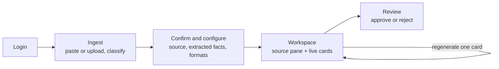
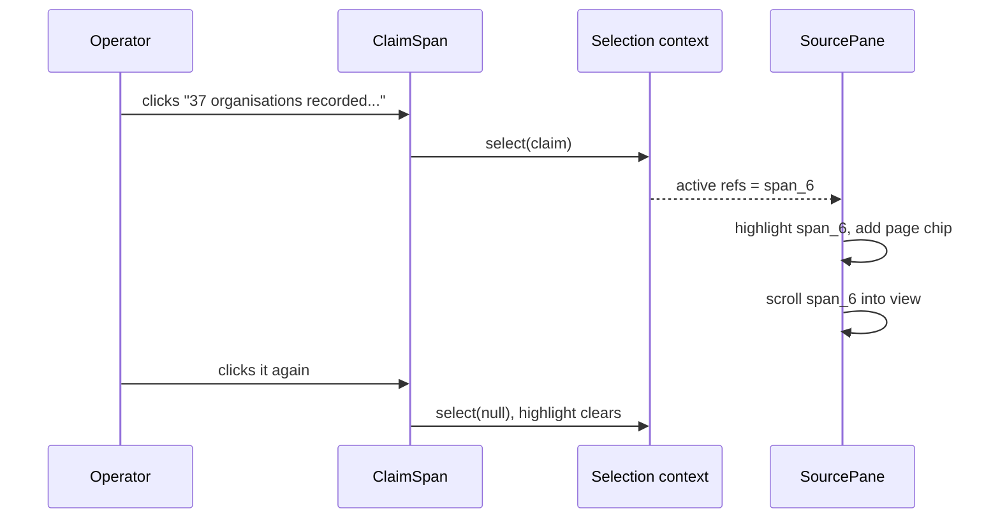
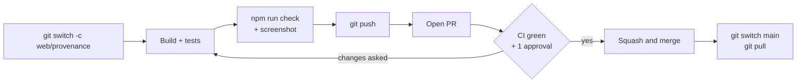

# SIH26154 — Frontend Guide (Person C)

Sep 25, 2026 · @Shahil Khan

You own `apps/web` — the half of the product a judge actually looks at. By Sunday 27 September, clicking any sentence in a generated artefact must light up the passage it came from.

The Final SRS is the contract; this guide is the build order. Where they disagree, the SRS wins and you tell the team.

## 1. Your job and your finish line

You build four screens and one interaction. The screens make the pipeline usable; the interaction — click a sentence, see where it came from — is what makes a judge believe the output is not invented (SRS §5.5).



### What you own

| Piece | Where |
| --- | --- |
| Every screen, component, state and style | `apps/web/src/` |
| Mock data for every card state | `apps/web/src/mocks/` |
| The provenance interaction | `apps/web/src/components/ClaimSpan.tsx`, `SourcePane.tsx` |
| The screenshots in the deck | handed to A on Sunday |
| Component and state tests | `apps/web/src/**/*.test.ts(x)` (Step 9) |

### The acceptance criteria you answer for

| AC | You prove | Due |
| --- | --- | --- |
| AC-2 | Selecting a claim highlights its source passage | Sun 27 |
| AC-9 | A failed card shows Retry while the others display; the batch reads `partial` | Sun 27 |
| AC-11 | A card whose config was overridden shows a badge | Sat 26 |
| AC-13 | With B: the socket drops and reconnects, and no card is stranded | Sun 27 |
| AC-16 | With D: the card shows `1 fix` and exactly what was repaired | Sun 27 |
| AC-18 | A claim from a PDF shows its page number | Sun 27 if time, else Phase 2 |
| AC-6 | The review screens | Phase 2 |

### Hand-offs

| Direction | What | When |
| --- | --- | --- |
| From D | One real result JSON per format, for mocks | Fri 25, evening |
| From B | Login, ingest, batch and stream endpoints running | Sat 26, evening |
| To A | Six screenshots, listed in Step 8 | Sun 27, evening |

### The team and the repository

| | Role | Name | GitHub |
| --- | --- | --- | --- |
| A | Deck & narrative | Rehan Fazal | [@Rehan9599](https://github.com/Rehan9599) |
| B | Backend | Farhan Quamar | [@quamarfarhan007](https://github.com/quamarfarhan007) |
| C | Frontend | Faizan Ahmad Ansari | [@Faizan0916](https://github.com/Faizan0916) |
| D | AI systems, repository owner | Md Fareed Khan | [@MdFareedKhan01](https://github.com/MdFareedKhan01) |

The code lives at [github.com/MdFareedKhan01/sih_ps154](https://github.com/MdFareedKhan01/sih_ps154): [pull requests](https://github.com/MdFareedKhan01/sih_ps154/pulls) · [CI runs](https://github.com/MdFareedKhan01/sih_ps154/actions). The repository is **public**: never commit `.env`, a key or real data. Reviews are requested automatically from each folder's owner (`.github/CODEOWNERS`).

## 2. Your four days

Each day ends at a gate. If a gate slips, cut polish from the next day, never the gate.

| Day | Build | Done means |
| --- | --- | --- |
| **Fri 25** | Setup (Step 0). Hour zero with the team (Step 1). Wireframes agreed (Step 2). Login and routing (Step 3) | A `/gallery` page renders every card state from mock data, and login works against B's API |
| **Sat 26** | Ingest, confirm and configure (Step 4). Workspace state and socket (Step 5), against B's stub engine | Pasting the demo source produces cards that move through their states live |
| **Sun 27** | Cards (Step 6). The provenance split view (Step 7). Polish and screenshots (Step 8) | AC-2, AC-9, AC-13 and AC-16 pass; six screenshots sent to A |
| **Mon 28** | Freeze. Projector check. Help A record the video | The demo runs three times in a row without anyone touching code |

- [ ] Friday gate
- [ ] Saturday gate
- [ ] Sunday gate
- [ ] Monday gate

**A gate counts only once it is on `main`.** Work on a branch, test it (Step 9) and merge it through a pull request (Step 10). One screen or component per PR keeps reviews to minutes.

**Build against mocks, always.** The `/gallery` page renders every card in every state from files in `mocks/`. You never wait for B or D, and A can screenshot states that are hard to trigger on demand, such as an error card or a flagged one.

## Step 0 — Setup

The app is already scaffolded in `apps/web`, inside the monorepo, so there is nothing to create. Get the repo running on your machine — the same commands the whole team runs at hour zero (Guide B, Step 1):

```bash
git clone https://github.com/MdFareedKhan01/sih_ps154.git && cd sih_ps154
npm install                    # every workspace, one lockfile
cp .env.example .env           # PowerShell: Copy-Item .env.example .env
npm run dev:web                # http://localhost:5173 shows a placeholder page
npm run test -w @ps154/web     # one placeholder test passes
```

You need Docker only to run B's API on your own laptop, from Saturday. Until then you build against mocks.

**What the scaffold already contains.**

| File | What it holds |
| --- | --- |
| `apps/web/package.json` | `@ps154/web`: React 19, Vite 8, TypeScript 6, `react-router`, Tailwind 4 and `@ps154/shared`; Vitest, Testing Library and jsdom for tests. Scripts: `dev`, `build`, `typecheck`, `test`, `test:watch`, `lint` |
| `vite.config.ts` | Below |
| `src/index.css` | `@import "tailwindcss";` and nothing else |
| `src/test/setup.ts` | Loads the Testing Library matchers, clears the DOM after each test, and stubs `scrollIntoView`, which jsdom lacks and `SourcePane` calls |
| `tsconfig.app.json` | Vite's strict defaults, plus `resolveJsonModule` for the mock imports. `erasableSyntaxOnly` is removed, because `ApiError` in Step 3 uses constructor parameter properties |
| `src/main.tsx`, `App.tsx`, `App.test.tsx` | A placeholder page and its test. Step 3 replaces `main.tsx`; delete the other two then |

**`apps/web/vite.config.ts`** — the proxy sends REST calls and the WebSocket to B's API, so the browser never meets CORS and no host names are hard-coded. The `test` block runs component tests in jsdom, a simulated browser.

```ts
/// <reference types="vitest/config" />
import { defineConfig } from 'vite';
import react from '@vitejs/plugin-react';
import tailwindcss from '@tailwindcss/vite';

export default defineConfig({
  plugins: [react(), tailwindcss()],
  server: {
    // REST calls and the WebSocket go to B's API, so the browser never meets CORS.
    proxy: { '/api': { target: 'http://localhost:8080', ws: true } },
  },
  test: {
    environment: 'jsdom',
    setupFiles: ['./src/test/setup.ts'],
  },
});
```

**Adding a package.** From the repo root: `npm i <package> -w @ps154/web`. Never run a bare `npm i` inside `apps/web`; it would create a second lockfile. `npm run lint -w @ps154/web` runs oxlint: treat its warnings as advice, not a gate.

**The folders you will fill.**

```text
apps/web/src/
  main.tsx          router
  api.ts            fetch wrapper, token, socket URL
  selection.tsx     which claim is selected (context)
  pages/            Login, Ingest, Confirm, Workspace, Review, Gallery
  batch/            state.ts (reducer), useBatchStream.ts
  components/       Card, CardBoundary, VerificationBadge, ClaimSpan,
                    SourcePane, FactsPanel, ConfigPanel
  renderers/        Advisory, ExecutiveSummary, LinkedInPost, Generic
  mocks/            JSON for every state
  test/setup.ts     test setup (already there)
```

Tests sit beside the file they test: `Card.tsx` and `Card.test.tsx` (Step 9).

## Step 1 — Hour zero: the types you consume

You write no schemas; you import them. D defines claims, the canonical object and the formats; B defines the API and the frames. Everything is snake\_case, exactly as it arrives over the wire.

```ts
import type {
  Claim, ClaimStatus, Span, Canonical, Config, FormatId, Verification,
  Artifact, BatchCreated, BatchSnapshot, Frame, SourceRecord,
} from '@ps154/shared';
```

**The four shapes you render.**

| Shape | What it is | You use it for |
| --- | --- | --- |
| `Claim` | `{ id, text, source_refs, status, grounded }` | Every sentence you render as clickable |
| `Artifact` | The envelope: `status`, `content`, `verification`, `meta`, `version` | One card |
| `Frame` | `task.progress`, `task.completed`, `task.failed`, `batch.completed` | Live updates |
| `SourceRecord` | `raw_content` plus `spans` with offsets and optional `page` | The source pane and the facts panel |

**`content` is `unknown` on purpose.** Each format has its own layout, but every assertion inside it is a claim node. You render content by walking it: any object with `text`, `status` and `source_refs` is a claim, and becomes a `ClaimSpan`.

**`apps/web/src/mocks/advisory.ready.json`** — hand-written for Friday. On Saturday, replace every mock with a real `GET /api/v1/jobs/{id}` response from B.

```json
{
  "task_id": "t-adv", "batch_id": "b-demo", "format_id": "advisory",
  "effective_config": { "audience": "Sector CISOs", "tone": "formal", "detail": "medium", "language": "en" },
  "status": "ready", "review_state": "draft", "review_comment": null, "error_log": null, "version": 1,
  "grounding_score": 0.8,
  "verification": {
    "passed": true, "revised": true, "open_issues": [],
    "fixes": [ { "check": "identifier", "key": "identifier:42",
      "detail": "\"42 organisations were exposed\" cites span_6, which reads \"...37 organisations...\". 42 does not appear in the cited source." } ]
  },
  "meta": { "provider": "cloud", "model": "gemini-flash", "fallback_reason": null,
            "attempts": 2, "latency_ms": 8420, "perturbed": true },
  "claims": [],
  "content": {
    "title": "Credential phishing against power distribution utilities",
    "severity": "high",
    "summary": [
      { "id": "c1", "status": "inference", "grounded": true, "source_refs": ["span_6"],
        "text": "Between 14 and 17 September 2026, 37 organisations recorded indicators consistent with a possible phishing campaign." },
      { "id": "c2", "status": "fact", "grounded": true, "source_refs": ["span_8"],
        "text": "Three organisations have confirmed credential compromise." }
    ],
    "affected_systems": [
      { "id": "c3", "status": "fact", "grounded": true, "source_refs": ["span_13"],
        "text": "Edge VPN concentrators running firmware version 9.4.2." }
    ],
    "indicators": [ { "type": "domain", "value": "login-verify.example[.]com", "source_refs": ["span_17"] } ],
    "mitigations": [
      { "id": "c4", "status": "fact", "grounded": true, "source_refs": ["span_25"],
        "text": "Reset VPN credentials for all users at affected organisations." },
      { "id": "c5", "status": "inference", "grounded": false, "source_refs": [],
        "text": "Treat any unexplained VPN login since 14 September as a potential compromise." }
    ],
    "references": []
  }
}
```

The mock deliberately holds one of each claim style: a fact, an inference, and an unverified inference (`c5`). Span ids here are illustrative; the Saturday mocks carry real ones that match the real source.

**The other states are one-liners.** Copy the envelope and set `status` to `waiting`, `running`, `validating` or `revising` with `content: null`; or to `error` with `error_log: "Schema invalid after the targeted revision"`. For a flagged card, keep `ready` and move the fix into `open_issues`.

## Step 2 — The screens

Agree these four layouts with A on Friday, because the deck's screenshots come from them. Wording on screen matters: the classification text and the badges are read aloud in the demo.

**Ingest.** The classification choice states its consequence in plain words (SRS §11.5).

```text
+--------------------------------------------------------------------+
|  PS154 Content Transformation              operator   [Sign out]   |
+--------------------------------------------------------------------+
|  1 Source  >  2 Confirm  >  3 Generate                             |
|                                                                    |
|  [ Paste text ]  [ Upload PDF, DOCX, TXT ]                         |
|  +--------------------------------------------------------------+  |
|  | Paste a report, advisory or incident note...                 |  |
|  +--------------------------------------------------------------+  |
|  2,148 / 50,000 characters                                         |
|                                                                    |
|  ( ) Public      Sent to the cloud model. Best quality and speed.  |
|  (o) Internal    Sent to the cloud with IPs, domains and names     |
|                  masked first, then restored.                      |
|  ( ) Restricted  Processed entirely on this machine. Never sent    |
|                  to an external provider.                          |
|                                       [ Continue: extract facts ]  |
+--------------------------------------------------------------------+
```

**Confirm and configure.** The facts panel is a demo beat: it proves the system understood the source before writing anything.

```text
+-----------------------------------+--------------------------------+
| SOURCE   26 sentences             | EXTRACTED FACTS                |
|                                   | Severity    [HIGH]             |
| Between 14 and 17 September 2026, | Actor       TC-7               |
| sensors at 37 organisations in    | Systems     Edge VPN concentr. |
| the power distribution sector ... | Indicators  5                  |
|                                   | - 37 organisations ... inferred|
|                                   | - Three confirmed ...     fact |
+-----------------------------------+--------------------------------+
| Audience [Senior government officials v]   Tone [formal v]         |
| Detail [medium v]   Language [English v]                           |
| [x] Security advisory                              [ override ]    |
| [x] Executive summary                              [ override ]    |
| [x] LinkedIn post      tone: conversational        [ override ]    |
|                                                  [ Generate 3 ]    |
+--------------------------------------------------------------------+
```

**Workspace.** The source pane on the left, one independent card per format on the right. Selecting a sentence in a card highlights its passage on the left.

```text
+----------------------------------+---------------------------------+
| SOURCE                  page 1   | running . 1 of 3 ready          |
|                                  +---------------------------------+
| Between 14 and 17 September      | ADVISORY                  READY |
| 2026, sensors at 37 organisations| [HIGH] Credential phishing ...  |
| [recorded indicators consistent  | Between 14 and 17 September,    |
| with a possible phishing         | 37 organisations recorded ...   |
| campaign.]  <- highlighted       |            0.91 . 1 fix     v   |
|                                  | [Regenerate] [Export] [Submit]  |
| Analysts attribute the activity, +---------------------------------+
| with moderate confidence, ...    | EXECUTIVE SUMMARY      revising |
|                                  | Repairing 1 finding . 00:14     |
|                                  +---------------------------------+
|                                  | LINKEDIN POST           running |
|                                  | Writing . 00:09                 |
+----------------------------------+---------------------------------+
```

**Anatomy of a ready card.**

```text
+-----------------------------------------------------------+
| LINKEDIN POST   tone overridden   v2              READY   |  label, override badge,
|                                                           |  version, status
| 37 organisations saw signs of a possible phishing         |  content, walked:
| campaign. inferred   Here is what to do.   Reset VPN      |  every claim is
| credentials now.   Unexplained logins may... unverified   |  clickable
|                                                           |
| 0.80 . 1 fix . 1 flag   v           processed on device   |  score + badge, provider
| [Regenerate]   [Export .md]   [Submit for review]         |  actions
+-----------------------------------------------------------+
```

**Review**, in Phase 2: a queue of submitted artefacts on the left, the same card and source pane on the right, and *Approve* or *Reject with a comment* underneath.

## Step 3 — API client, login and routing

Every request goes through one function that adds the token, parses errors into readable messages, and sends a signed-out user back to the login page.

**`apps/web/src/api.ts`**

```ts
const KEY = 'ps154.token';
const stored = () => { try { return localStorage.getItem(KEY); } catch { return null; } };
let token: string | null = stored();

export function setToken(t: string | null) {
  token = t;
  try { if (t) localStorage.setItem(KEY, t); else localStorage.removeItem(KEY); } catch { /* private window */ }
}
export const getToken = () => token;

/** The signed-in user, read from the token's payload. */
export function getUser(): { id: string; name: string; role: 'operator' | 'reviewer' | 'admin' } | null {
  if (!token) return null;
  try { return JSON.parse(atob(token.split('.')[1].replace(/-/g, '+').replace(/_/g, '/'))); }
  catch { return null; }
}

export class ApiError extends Error {
  constructor(public status: number, message: string, public body?: any) { super(message); }
}

export async function api<T>(path: string, init: RequestInit = {}): Promise<T> {
  const headers = new Headers(init.headers);
  if (token) headers.set('Authorization', `Bearer ${token}`);
  if (init.body && !(init.body instanceof FormData)) headers.set('Content-Type', 'application/json');
  const res = await fetch(`/api/v1${path}`, { ...init, headers });
  const body = await res.json().catch(() => ({}));
  if (res.status === 401 && path !== '/auth/login') { setToken(null); location.assign('/login'); }
  if (!res.ok) throw new ApiError(res.status, body.error ?? res.statusText, body);
  return body as T;
}

/** Exports return files, not JSON. */
export async function download(path: string, filename: string) {
  const res = await fetch(`/api/v1${path}`, { headers: { Authorization: `Bearer ${token}` } });
  const url = URL.createObjectURL(await res.blob());
  Object.assign(document.createElement('a'), { href: url, download: filename }).click();
  URL.revokeObjectURL(url);
}

export const socketUrl = (path: string) =>
  `${location.protocol === 'https:' ? 'wss' : 'ws'}://${location.host}/api/v1${path}`;
```

**`apps/web/src/main.tsx`** — the guard checks the token at render time, so it sees a login that happened after the page loaded.

```tsx
import { StrictMode, type ReactNode } from 'react';
import { createRoot } from 'react-dom/client';
import { createBrowserRouter, RouterProvider, Navigate } from 'react-router';
import './index.css';
import { getToken } from './api';
import Login from './pages/Login';
import Ingest from './pages/Ingest';
import Confirm from './pages/Confirm';
import Workspace from './pages/Workspace';
import Gallery from './pages/Gallery';

function Guard({ children }: { children: ReactNode }) {
  return getToken() ? children : <Navigate to="/login" replace />;
}

const router = createBrowserRouter([
  { path: '/login', element: <Login /> },
  { path: '/', element: <Guard><Ingest /></Guard> },
  { path: '/sources/:id', element: <Guard><Confirm /></Guard> },
  { path: '/batches/:id', element: <Guard><Workspace /></Guard> },
  { path: '/gallery', element: <Gallery /> },
]);

createRoot(document.getElementById('root')!).render(
  <StrictMode><RouterProvider router={router} /></StrictMode>,
);
```

This replaces the scaffold's placeholder `main.tsx`. Delete `src/App.tsx` and `src/App.test.tsx` in the same commit.

**`apps/web/src/pages/Login.tsx`**

```tsx
import { useState, type FormEvent } from 'react';
import { useNavigate } from 'react-router';
import { api, setToken } from '../api';

export default function Login() {
  const navigate = useNavigate();
  const [error, setError] = useState('');

  async function submit(e: FormEvent<HTMLFormElement>) {
    e.preventDefault();
    const f = new FormData(e.currentTarget);
    try {
      const r = await api<{ token: string }>('/auth/login', {
        method: 'POST', body: JSON.stringify({ name: f.get('name'), password: f.get('password') }) });
      setToken(r.token);
      navigate('/');
    } catch (err) { setError((err as Error).message); }
  }

  return (
    <form onSubmit={submit} className="mx-auto mt-24 max-w-sm space-y-4 rounded-lg border p-6">
      <h1 className="text-xl font-semibold">Sign in</h1>
      <input name="name" placeholder="operator" className="w-full rounded border px-3 py-2" />
      <input name="password" type="password" placeholder="Password" className="w-full rounded border px-3 py-2" />
      {error && <p className="text-sm text-red-700">{error}</p>}
      <button className="w-full rounded bg-slate-900 py-2 text-white">Sign in</button>
    </form>
  );
}
```

`StrictMode` runs every effect twice in development. That is intended: it proves the socket hook in Step 5 cleans up after itself. If you see two connections per batch in DevTools during development, that is StrictMode, not a bug.

## Step 4 — Ingest, confirm and configure

Two screens take the operator from raw text to a running batch. Ingestion waits for fact extraction, which can take 5 to 40 seconds, so the button must say what is happening rather than just spin.

**`apps/web/src/pages/Ingest.tsx`**

```tsx
import { useState } from 'react';
import { useNavigate } from 'react-router';
import type { Classification, SourceRecord } from '@ps154/shared';
import { api } from '../api';

const TIERS: { value: Classification; label: string; consequence: string }[] = [
  { value: 'public', label: 'Public',
    consequence: 'Sent to the cloud model. Best quality and speed. For material cleared for release.' },
  { value: 'internal', label: 'Internal',
    consequence: 'Sent to the cloud model with IP addresses, domains, emails and named terms masked first, then restored.' },
  { value: 'restricted', label: 'Restricted',
    consequence: 'Processed entirely on this machine. Never sent to an external provider.' },
];

export default function Ingest() {
  const navigate = useNavigate();
  const [text, setText] = useState('');
  const [file, setFile] = useState<File | null>(null);
  const [tier, setTier] = useState<Classification>('internal');
  const [busy, setBusy] = useState(false);
  const [error, setError] = useState('');

  async function submit() {
    setBusy(true); setError('');
    try {
      let body: BodyInit;
      if (file) {
        const form = new FormData();
        form.append('classification', tier);
        form.append('file', file);
        body = form;
      } else {
        body = JSON.stringify({ text, classification: tier });
      }
      const source = await api<SourceRecord>('/sources', { method: 'POST', body });
      navigate(`/sources/${source.id}`);
    } catch (e) { setError((e as Error).message); }
    finally { setBusy(false); }
  }

  return (
    <main className="mx-auto max-w-3xl space-y-6 p-8">
      <h1 className="text-2xl font-semibold">New source</h1>
      <textarea value={text} onChange={(e) => { setText(e.target.value); setFile(null); }}
        placeholder="Paste a report, advisory or incident note..." rows={12}
        className="w-full rounded border p-3 font-mono text-sm" />
      <div className="flex items-center justify-between text-sm text-slate-600">
        <span>{text.length.toLocaleString()} / 50,000 characters</span>
        <label>or upload <input type="file" accept=".pdf,.docx,.txt,.md"
          onChange={(e) => setFile(e.target.files?.[0] ?? null)} /></label>
      </div>
      <fieldset className="space-y-2">
        <legend className="font-medium">Classification</legend>
        {TIERS.map((t) => (
          <label key={t.value} className="flex gap-3 rounded border p-3">
            <input type="radio" checked={tier === t.value} onChange={() => setTier(t.value)} />
            <span><b>{t.label}</b> — {t.consequence}</span>
          </label>
        ))}
      </fieldset>
      {error && <p className="text-red-700">{error}</p>}
      <button disabled={busy || (!text.trim() && !file)} onClick={submit}
        className="rounded bg-slate-900 px-5 py-2 text-white disabled:opacity-40">
        {busy ? 'Reading the source and extracting facts — up to 40 seconds…' : 'Continue: extract facts'}
      </button>
    </main>
  );
}
```

**`apps/web/src/components/FactsPanel.tsx`** — the canonical object, shown to the operator before anything is written.

```tsx
import type { ReactNode } from 'react';
import type { Canonical } from '@ps154/shared';

const SEVERITY: Record<string, string> = {
  critical: 'bg-red-700 text-white', high: 'bg-orange-600 text-white',
  medium: 'bg-amber-400 text-black', low: 'bg-slate-300 text-black', unknown: 'bg-slate-100 text-slate-700',
};

export function SeverityPill({ value }: { value: string }) {
  return <span className={`rounded px-2 py-0.5 text-xs font-bold uppercase ${SEVERITY[value]}`}>{value}</span>;
}

export function FactsPanel({ c }: { c: Canonical }) {
  const actors = c.entities.filter((e) => e.type === 'threat_actor').map((e) => e.name);
  const row = (label: string, value: ReactNode) => (
    <div className="flex gap-3"><dt className="w-24 shrink-0 text-slate-500">{label}</dt><dd>{value}</dd></div>);
  return (
    <aside className="space-y-3 text-sm">
      <h2 className="font-semibold uppercase tracking-wide text-slate-500">Extracted facts</h2>
      <dl className="space-y-1">
        {row('Severity', <SeverityPill value={c.severity.value} />)}
        {actors.length > 0 && row('Actor', actors.join(', '))}
        {row('Systems', c.affected_systems.map((s) => s.name).join('; ') || '—')}
        {row('Indicators', c.indicators.length)}
      </dl>
      <ul className="list-disc space-y-1 pl-5">
        {c.key_facts.map((f, i) => (
          <li key={i}>{f.text} <span className="text-xs uppercase text-sky-700">
            {f.status === 'inference' ? 'inferred' : ''}</span></li>
        ))}
      </ul>
    </aside>
  );
}
```

**`apps/web/src/components/ConfigPanel.tsx`** — builds exactly the request body in SRS §10.2. An override that says *same as global* is dropped, so `effective_config` only records real overrides.

```tsx
import { useState } from 'react';
import type { Config, FormatId } from '@ps154/shared';

export type FormatOption = { id: FormatId; label: string };
type Overrides = Partial<Pick<Config, 'tone' | 'detail' | 'language'>>;

const TONES = ['formal', 'neutral', 'conversational'] as const;
const DETAILS = ['brief', 'medium', 'detailed'] as const;
const LANGUAGES = [['en', 'English'], ['hi', 'Hindi']] as const;

export function ConfigPanel({ formats, busy, onGenerate }: {
  formats: FormatOption[]; busy: boolean;
  onGenerate: (body: { global_config: Config; formats: { format_id: FormatId; overrides?: Overrides }[] }) => void;
}) {
  const [global, setGlobal] = useState<Config>({
    audience: 'Senior government officials', tone: 'formal', detail: 'medium', language: 'en' });
  const [selected, setSelected] = useState<FormatId[]>(formats.slice(0, 3).map((f) => f.id));
  const [overrides, setOverrides] = useState<Record<string, Overrides>>({});

  const setOverride = (id: string, key: keyof Overrides, value: string) =>
    setOverrides((o) => {
      const next = { ...o[id] };
      if (value === '') delete next[key]; else (next as any)[key] = value;
      return { ...o, [id]: next };
    });

  const generate = () => onGenerate({
    global_config: global,
    formats: selected.map((id) => Object.keys(overrides[id] ?? {}).length
      ? { format_id: id, overrides: overrides[id] } : { format_id: id }),
  });

  const select = (value: string, options: readonly (string | readonly [string, string])[],
                  onChange: (v: string) => void, withSame = false) => (
    <select value={value} onChange={(e) => onChange(e.target.value)} className="rounded border px-2 py-1">
      {withSame && <option value="">same as global</option>}
      {options.map((o) => typeof o === 'string'
        ? <option key={o} value={o}>{o}</option>
        : <option key={o[0]} value={o[0]}>{o[1]}</option>)}
    </select>);

  return (
    <section className="space-y-4">
      <div className="flex flex-wrap gap-4 text-sm">
        <label>Audience <input list="audiences" value={global.audience}
          onChange={(e) => setGlobal({ ...global, audience: e.target.value })} className="rounded border px-2 py-1" /></label>
        <datalist id="audiences">
          <option value="Senior government officials" /><option value="Sector CISOs" />
          <option value="SOC analysts" /><option value="General public" />
        </datalist>
        <label>Tone {select(global.tone, TONES, (v) => setGlobal({ ...global, tone: v as Config['tone'] }))}</label>
        <label>Detail {select(global.detail, DETAILS, (v) => setGlobal({ ...global, detail: v as Config['detail'] }))}</label>
        <label>Language {select(global.language, LANGUAGES, (v) => setGlobal({ ...global, language: v as Config['language'] }))}</label>
      </div>
      <ul className="space-y-2">
        {formats.map((f) => {
          const on = selected.includes(f.id);
          return (
            <li key={f.id} className="flex flex-wrap items-center gap-3 rounded border p-2 text-sm">
              <label className="w-48"><input type="checkbox" checked={on} onChange={() =>
                setSelected((s) => on ? s.filter((x) => x !== f.id) : [...s, f.id])} /> {f.label}</label>
              {on && <>
                tone {select(overrides[f.id]?.tone ?? '', TONES, (v) => setOverride(f.id, 'tone', v), true)}
                detail {select(overrides[f.id]?.detail ?? '', DETAILS, (v) => setOverride(f.id, 'detail', v), true)}
                language {select(overrides[f.id]?.language ?? '', LANGUAGES, (v) => setOverride(f.id, 'language', v), true)}
              </>}
            </li>);
        })}
      </ul>
      <button disabled={busy || selected.length === 0 || selected.length > 6} onClick={generate}
        className="rounded bg-slate-900 px-5 py-2 text-white disabled:opacity-40">
        Generate {selected.length}
      </button>
    </section>
  );
}
```

**`apps/web/src/pages/Confirm.tsx`**

```tsx
import { useEffect, useState } from 'react';
import { useNavigate, useParams } from 'react-router';
import type { BatchCreated, SourceRecord } from '@ps154/shared';
import { api } from '../api';
import { FactsPanel } from '../components/FactsPanel';
import { ConfigPanel, type FormatOption } from '../components/ConfigPanel';
import { SourcePane } from '../components/SourcePane';

// Until B serves GET /formats from D's registry, this list stands in for it.
const FALLBACK: FormatOption[] = [
  { id: 'advisory', label: 'Security advisory' },
  { id: 'executive_summary', label: 'Executive summary' },
  { id: 'linkedin_post', label: 'LinkedIn post' },
];

export default function Confirm() {
  const { id } = useParams();
  const navigate = useNavigate();
  const [source, setSource] = useState<SourceRecord | null>(null);
  const [formats, setFormats] = useState<FormatOption[]>(FALLBACK);
  const [busy, setBusy] = useState(false);

  useEffect(() => {
    api<SourceRecord>(`/sources/${id}`).then(setSource);
    api<FormatOption[]>('/formats').then(setFormats).catch(() => {});
  }, [id]);
  if (!source) return <p className="p-8">Loading source…</p>;

  async function generate(body: object) {
    setBusy(true);
    const batch = await api<BatchCreated>('/jobs/batch', {
      method: 'POST', body: JSON.stringify({ source_id: source!.id, ...body }) });
    navigate(`/batches/${batch.batch_id}`);
  }

  return (
    <main className="grid gap-6 p-6 lg:grid-cols-[3fr_2fr]">
      <div className="max-h-[50vh] overflow-y-auto rounded border p-4">
        <SourcePane raw={source.raw_content} spans={source.spans} active={new Set()} />
      </div>
      {source.canonical && <FactsPanel c={source.canonical} />}
      <div className="lg:col-span-2"><ConfigPanel formats={formats} busy={busy} onGenerate={generate} /></div>
    </main>
  );
}
```

`SourcePane` is built in Step 7; until then, render `source.raw_content` inside a `<pre>`.

## Step 5 — The workspace: state and the live stream

**One status per card, never one for the page** (SRS §11.1). Cards live in a record keyed by `task_id`. A frame patches exactly one card and leaves the others untouched, so the slowest format never holds the page hostage and a failed one never blanks it.

```text
GET /jobs/{id}  --> fromSnapshot --> view.cards { t1, t2, t3 }   + stream_last_id
                                          ^
WebSocket frame --> reducer(view, frame) -+  patches ONE card by task_id
(reconnects with since = last seq seen, so nothing is lost or applied twice)
```

**`apps/web/src/batch/state.ts`**

```ts
import type { Artifact, BatchSnapshot, Config, Frame } from '@ps154/shared';

export type Card = {
  task_id: string;
  format_id: string;
  status: Artifact['status'];
  effective_config: Config;
  detail?: string;
  started_at?: number;
  artifact?: Artifact;
  error?: { code: string; message: string; retryable: boolean };
};
export type BatchView = {
  batch_id: string; overall: string; last_seq: string;
  global_config: Config; cards: Record<string, Card>;
};

export function fromSnapshot(s: BatchSnapshot): BatchView {
  const cards: Record<string, Card> = {};
  for (const a of s.artifacts) {
    cards[a.task_id] = {
      task_id: a.task_id, format_id: a.format_id, status: a.status, effective_config: a.effective_config,
      artifact: a.status === 'ready' ? a : undefined,
      error: a.status === 'error'
        ? { code: 'FAILED', message: a.error_log ?? 'Generation failed', retryable: true } : undefined,
    };
  }
  return { batch_id: s.batch_id, overall: s.overall_status, last_seq: s.stream_last_id,
           global_config: s.global_config, cards };
}

export type Action =
  | { type: 'frame'; frame: Frame }
  | { type: 'regenerating'; task_id: string };

export function reducer(state: BatchView, action: Action): BatchView {
  if (action.type === 'regenerating') {
    return { ...patch(state, action.task_id,
      { status: 'waiting', artifact: undefined, error: undefined, detail: undefined }), overall: 'running' };
  }
  const f = action.frame;
  const s = { ...state, last_seq: f.seq };
  switch (f.event) {
    case 'task.progress':
      return patch(s, f.task_id, {
        status: f.status, detail: f.detail,
        started_at: f.status === 'running' ? Date.now() : state.cards[f.task_id]?.started_at });
    case 'task.completed':
      return patch(s, f.task_id, { status: 'ready', artifact: f.artifact, error: undefined, detail: undefined });
    case 'task.failed':
      return patch(s, f.task_id, { status: 'error',
        error: { code: f.error_code, message: f.message, retryable: f.retryable } });
    case 'batch.completed':
      return { ...s, overall: f.overall_status };
  }
}

function patch(s: BatchView, id: string, p: Partial<Card>): BatchView {
  const prev = s.cards[id];
  if (!prev) return s; // a frame for a task this page does not know: ignore it
  return { ...s, cards: { ...s.cards, [id]: { ...prev, ...p } } };
}
```

**`apps/web/src/batch/useBatchStream.ts`** — AC-13 lives here.

```ts
import { useEffect, useRef } from 'react';
import type { Frame } from '@ps154/shared';
import { getToken, socketUrl } from '../api';

/** Streams frames after `since`; after a drop, reconnects from the last frame seen. */
export function useBatchStream(batchId: string, since: string, onFrame: (f: Frame) => void) {
  const handler = useRef(onFrame);
  handler.current = onFrame;

  useEffect(() => {
    let last = since;
    let ws: WebSocket | null = null;
    let stopped = false;
    let retry = 0;
    let timer: number | undefined;

    const connect = () => {
      ws = new WebSocket(socketUrl(
        `/jobs/${batchId}/stream?since=${encodeURIComponent(last)}&token=${getToken()}`));
      ws.onopen = () => { retry = 0; };
      ws.onmessage = (e) => {
        const frame = JSON.parse(e.data) as Frame;
        last = frame.seq;
        handler.current(frame);
      };
      ws.onclose = () => {
        if (!stopped) timer = window.setTimeout(connect, Math.min(500 * 2 ** retry++, 8000));
      };
    };
    connect();
    return () => { stopped = true; window.clearTimeout(timer); ws?.close(); };
  }, [batchId, since]);
}
```

**`apps/web/src/selection.tsx`** — which claim is selected, shared by every card and the source pane.

```tsx
import { createContext, useContext } from 'react';
import type { Claim } from '@ps154/shared';

export const SelectionContext = createContext<{
  active: Claim | null; select: (c: Claim | null) => void;
}>({ active: null, select: () => {} });

export const useSelection = () => useContext(SelectionContext);
```

**`apps/web/src/pages/Workspace.tsx`** — load the snapshot first, then stream from where it ends.

```tsx
import { useEffect, useMemo, useReducer, useState } from 'react';
import { useParams } from 'react-router';
import type { BatchSnapshot, Claim, SourceRecord } from '@ps154/shared';
import { api } from '../api';
import { fromSnapshot, reducer, type BatchView } from '../batch/state';
import { useBatchStream } from '../batch/useBatchStream';
import { SelectionContext } from '../selection';
import { SourcePane } from '../components/SourcePane';
import { CardView } from '../components/Card';
import { CardBoundary } from '../components/CardBoundary';

export default function Workspace() {
  const { id } = useParams();
  const [initial, setInitial] = useState<BatchView | null>(null);
  const [source, setSource] = useState<SourceRecord | null>(null);
  useEffect(() => {
    api<BatchSnapshot>(`/jobs/${id}`).then(async (s) => {
      setSource(await api<SourceRecord>(`/sources/${s.source_id}`));
      setInitial(fromSnapshot(s));
    });
  }, [id]);
  if (!initial || !source) return <p className="p-8">Loading batch…</p>;
  return <LiveBatch initial={initial} source={source} />;
}

function LiveBatch({ initial, source }: { initial: BatchView; source: SourceRecord }) {
  const [view, dispatch] = useReducer(reducer, initial);
  useBatchStream(initial.batch_id, initial.last_seq, (frame) => dispatch({ type: 'frame', frame }));
  const [active, setActive] = useState<Claim | null>(null);
  const activeRefs = useMemo(() => new Set(active?.source_refs ?? []), [active]);
  const cards = Object.values(view.cards);
  const ready = cards.filter((c) => c.status === 'ready').length;

  async function regenerate(task_id: string) {
    dispatch({ type: 'regenerating', task_id });
    await api(`/tasks/${task_id}/regenerate`, { method: 'POST' });
  }

  return (
    <SelectionContext.Provider value={{ active, select: setActive }}>
      <main className="grid h-screen grid-cols-[2fr_3fr]">
        <section className="overflow-y-auto border-r p-6">
          <SourcePane raw={source.raw_content} spans={source.spans} active={activeRefs} />
        </section>
        <section className="space-y-4 overflow-y-auto bg-slate-50 p-6">
          <p className="text-sm text-slate-600">{view.overall} · {ready} of {cards.length} ready</p>
          {cards.map((c) => (
            <CardBoundary key={c.task_id} label={c.format_id}>
              <CardView card={c} globalConfig={view.global_config}
                        onRegenerate={() => regenerate(c.task_id)} />
            </CardBoundary>
          ))}
        </section>
      </main>
    </SelectionContext.Provider>
  );
}
```

**Saturday's gate test.** Paste the demo source and generate three formats against B's stub engine. Three cards appear instantly as *waiting*, then move through *running* and *validating* to *ready* one at a time. The page never shows a single global spinner.

## Step 6 — Cards

A card has six states, and each must look different: a queued card that looks like a running one makes the page seem frozen (SRS §11.3). Every card sits inside its own error boundary, so one malformed artefact can never take its siblings down with it.

| Status | The card shows |
| --- | --- |
| `waiting` | *Queued — starts when one of three slots frees* |
| `running` | *Writing* and an elapsed timer |
| `validating` | *Checking facts* and the timer |
| `revising` | *Repairing* plus the detail, for example *1 finding* |
| `ready` | The content, the verification badge, provider badge, actions |
| `error` | The message and a Retry button |

**`apps/web/src/components/CardBoundary.tsx`**

```tsx
import { Component, type ReactNode } from 'react';

export class CardBoundary extends Component<{ label: string; children: ReactNode }, { error: Error | null }> {
  state = { error: null as Error | null };
  static getDerivedStateFromError(error: Error) { return { error }; }
  render() {
    if (!this.state.error) return this.props.children;
    return (
      <div className="rounded border border-red-300 bg-white p-4 text-sm">
        The {this.props.label.replace(/_/g, ' ')} card could not be displayed. The other cards are unaffected.
      </div>
    );
  }
}
```

**`apps/web/src/components/VerificationBadge.tsx`** — the visible half of D's verifier, and the AC-16 moment.

```tsx
import { useState } from 'react';
import type { Verification } from '@ps154/shared';

export function VerificationBadge({ score, v }: { score: number; v: Verification | null }) {
  const [open, setOpen] = useState(false);
  const fixes = v?.fixes.length ?? 0;
  const flags = v?.open_issues.length ?? 0;
  const label = [score.toFixed(2),
    fixes ? `${fixes} fix${fixes > 1 ? 'es' : ''}` : '',
    flags ? `${flags} flag${flags > 1 ? 's' : ''}` : ''].filter(Boolean).join(' · ');
  return (
    <div>
      <button onClick={() => setOpen(!open)} disabled={!fixes && !flags}
        className={`rounded px-2 py-0.5 text-xs font-medium ${flags
          ? 'bg-amber-100 text-amber-900' : 'bg-emerald-100 text-emerald-900'}`}>
        {label}{fixes || flags ? (open ? ' ▴' : ' ▾') : ''}
      </button>
      {open && v && (
        <ul className="mt-2 space-y-1 text-xs">
          {v.fixes.map((f) => <li key={f.key}><b>Repaired:</b> {f.detail}</li>)}
          {v.open_issues.map((f) => <li key={f.key}><b>For the reviewer:</b> {f.detail}</li>)}
        </ul>
      )}
    </div>
  );
}
```

**`apps/web/src/renderers/index.tsx`** — three designed views for Phase 1, and one generic walker so any new format renders with no new code (AC-12).

```tsx
import type React from 'react';
import type { Claim } from '@ps154/shared';
import { ClaimSpan } from '../components/ClaimSpan';
import { SeverityPill } from '../components/FactsPanel';

export const isClaim = (v: any): v is Claim => !!v && typeof v === 'object'
  && typeof v.text === 'string' && typeof v.status === 'string' && Array.isArray(v.source_refs);

const Inline = ({ items }: { items: unknown }) =>
  <>{(Array.isArray(items) ? items : [items]).filter(isClaim).map((c) => <ClaimSpan key={c.id} claim={c} />)}</>;

const List = ({ items, ordered = false }: { items: unknown[]; ordered?: boolean }) => {
  const Tag = ordered ? 'ol' : 'ul';
  return (
    <Tag className={`${ordered ? 'list-decimal' : 'list-disc'} space-y-1 pl-5`}>
      {items.filter(isClaim).map((c) => <li key={c.id}><ClaimSpan claim={c} /></li>)}
    </Tag>
  );
};

const Heading = ({ children }: { children: string }) =>
  <h4 className="mt-3 text-xs font-semibold uppercase tracking-wide text-slate-500">{children}</h4>;

function AdvisoryView({ content: c }: { content: any }) {
  return (
    <div className="space-y-2 leading-relaxed">
      <p className="flex items-center gap-2 font-semibold"><SeverityPill value={c.severity} /> {c.title}</p>
      <p><Inline items={c.summary} /></p>
      <Heading>Affected systems</Heading><List items={c.affected_systems} />
      <Heading>Indicators</Heading>
      <ul className="font-mono text-sm">{c.indicators.map((i: any) => <li key={i.value}>{i.type}: {i.value}</li>)}</ul>
      <Heading>Mitigations</Heading><List items={c.mitigations} ordered />
    </div>
  );
}

function ExecutiveSummaryView({ content: c }: { content: any }) {
  return (
    <div className="space-y-2 leading-relaxed">
      <p className="text-lg font-semibold">{c.headline}</p>
      <List items={c.key_points} />
      <Heading>Impact</Heading><p><Inline items={c.impact} /></p>
      <Heading>Decisions required</Heading><List items={c.decisions_required} ordered />
    </div>
  );
}

function LinkedInPostView({ content: c }: { content: any }) {
  return (
    <div className="rounded border bg-white p-4 leading-relaxed">
      <p className="mb-2 text-sm text-slate-500">Sector CERT (demo) · now</p>
      <p className="font-semibold"><Inline items={c.hook} /></p>
      <p className="mt-2"><Inline items={c.body} /></p>
      <p className="mt-2 text-sky-700">{c.hashtags.map((h: string) => (h.startsWith('#') ? h : `#${h}`)).join(' ')}</p>
    </div>
  );
}

/** Any format: headings from field names, claims as ClaimSpans, lists as lists. */
export function GenericView({ content }: { content: unknown }) {
  const walk = (v: unknown): React.ReactNode => {
    if (isClaim(v)) return <ClaimSpan claim={v} />;
    if (Array.isArray(v)) return <ul className="list-disc pl-5">{v.map((x, i) => <li key={i}>{walk(x)}</li>)}</ul>;
    if (v && typeof v === 'object') return Object.entries(v)
      .filter(([k]) => !['source_refs', 'id', 'grounded', 'status'].includes(k))
      .map(([k, x]) => <div key={k}><Heading>{k.replace(/_/g, ' ')}</Heading>{walk(x)}</div>);
    return <span>{String(v)}</span>;
  };
  return <div className="space-y-1">{walk(content)}</div>;
}

export const RENDERERS: Record<string, (p: { content: any }) => React.ReactNode> = {
  advisory: AdvisoryView, executive_summary: ExecutiveSummaryView, linkedin_post: LinkedInPostView,
};
```

**`apps/web/src/components/Card.tsx`**

```tsx
import { useEffect, useState } from 'react';
import type { Artifact, Config } from '@ps154/shared';
import type { Card } from '../batch/state';
import { download } from '../api';
import { RENDERERS, GenericView } from '../renderers';
import { VerificationBadge } from './VerificationBadge';

const LABELS: Record<string, string> = { advisory: 'Security advisory', executive_summary: 'Executive summary',
  linkedin_post: 'LinkedIn post', x_thread: 'X thread', video_package: 'Video package' };
const PHASE: Record<string, string> = { running: 'Writing', validating: 'Checking facts', revising: 'Repairing' };

export function CardView({ card, globalConfig, onRegenerate }:
    { card: Card; globalConfig: Config; onRegenerate: () => void }) {
  const overridden = (['audience', 'tone', 'detail', 'language'] as const)
    .filter((k) => card.effective_config[k] !== globalConfig[k]);
  return (
    <article className="rounded-lg border bg-white p-5 shadow-sm">
      <header className="mb-3 flex items-center gap-3">
        <h3 className="font-semibold uppercase tracking-wide">{LABELS[card.format_id] ?? card.format_id}</h3>
        {overridden.length > 0 && (
          <span className="rounded bg-violet-100 px-2 text-xs text-violet-800">{overridden.join(', ')} overridden</span>)}
        {(card.artifact?.version ?? 1) > 1 && <span className="text-xs text-slate-500">v{card.artifact!.version}</span>}
        <span className="ml-auto text-xs font-medium uppercase text-slate-500">{card.status}</span>
      </header>
      {card.status === 'ready' && card.artifact ? <Ready a={card.artifact} onRegenerate={onRegenerate} />
        : card.status === 'error' ? <Failed message={card.error?.message} onRetry={onRegenerate} />
        : <Working card={card} />}
    </article>
  );
}

function Working({ card }: { card: Card }) {
  const [now, setNow] = useState(Date.now());
  useEffect(() => { const t = setInterval(() => setNow(Date.now()), 1000); return () => clearInterval(t); }, []);
  if (card.status === 'waiting') return <p className="text-sm text-slate-500">Queued — starts when one of three slots frees.</p>;
  const s = card.started_at ? Math.floor((now - card.started_at) / 1000) : 0;
  return (
    <div className="space-y-2">
      <p className="text-sm">{PHASE[card.status]}{card.detail ? ` — ${card.detail}` : ''} · {String(Math.floor(s / 60)).padStart(2, '0')}:{String(s % 60).padStart(2, '0')}</p>
      <div className="h-2 animate-pulse rounded bg-slate-200" />
      <div className="h-2 w-2/3 animate-pulse rounded bg-slate-200" />
    </div>
  );
}

function Ready({ a, onRegenerate }: { a: Artifact; onRegenerate: () => void }) {
  const View = RENDERERS[a.format_id] ?? GenericView;
  return (
    <>
      <View content={a.content} />
      <footer className="mt-4 flex flex-wrap items-center gap-3 border-t pt-3 text-sm">
        <VerificationBadge score={a.grounding_score ?? 0} v={a.verification} />
        {a.meta?.provider === 'local' && <span className="rounded bg-emerald-100 px-2 text-xs text-emerald-800">processed on this machine</span>}
        {a.meta?.provider === 'cache' && <span className="rounded bg-amber-100 px-2 text-xs text-amber-900">served from the offline pack</span>}
        <span className="flex-1" />
        <button onClick={onRegenerate} className="rounded border px-3 py-1">Regenerate</button>
        <button onClick={() => download(`/tasks/${a.task_id}/export?as=md`, `${a.format_id}-v${a.version}.md`)}
          className="rounded border px-3 py-1">Export .md</button>
      </footer>
    </>
  );
}

function Failed({ message, onRetry }: { message?: string; onRetry: () => void }) {
  return (
    <div className="space-y-2 text-sm">
      <p className="text-red-800">{message ?? 'Generation failed'}</p>
      <button onClick={onRetry} className="rounded border px-3 py-1">Retry</button>
    </div>
  );
}
```

**`apps/web/src/pages/Gallery.tsx`** — every state from one mock, for building and for A's screenshots.

```tsx
import type { Artifact } from '@ps154/shared';
import advisory from '../mocks/advisory.ready.json';
import { CardView } from '../components/Card';
import { CardBoundary } from '../components/CardBoundary';

const a = advisory as unknown as Artifact;
const base = { task_id: a.task_id, format_id: a.format_id, effective_config: a.effective_config };
const CARDS = [
  { ...base, status: 'waiting' as const },
  { ...base, status: 'running' as const, started_at: Date.now() - 9000 },
  { ...base, status: 'revising' as const, detail: '1 finding', started_at: Date.now() - 14000 },
  { ...base, status: 'error' as const, error: { code: 'SCHEMA_INVALID', message: 'Schema invalid after the targeted revision', retryable: true } },
  { ...base, status: 'ready' as const, artifact: a },
];

export default function Gallery() {
  return (
    <main className="grid gap-4 bg-slate-50 p-6 md:grid-cols-2">
      {CARDS.map((c, i) => (
        <CardBoundary key={i} label={c.format_id}>
          <CardView card={c} globalConfig={a.effective_config} onRegenerate={() => {}} />
        </CardBoundary>
      ))}
    </main>
  );
}
```

## Step 7 — The provenance split view

This is the most important interaction in the product (SRS §5.5, AC-2). Selecting any sentence in any card highlights the passage it came from in the source pane, scrolls to it, and shows the page for PDFs. It turns *an AI wrote this* into *here is where every sentence came from*. Build it before any polish.



**How each claim looks.** The operator must be able to see, without clicking, which sentences the source supports and which the model reasoned its way to (SRS §11.4).

| Claim | Looks like | Why |
| --- | --- | --- |
| `fact`, grounded | Plain; underline on hover | Normal reading, but clickable |
| `inference`, grounded | Dotted blue underline and an *inferred* tag | Reasoning, not reading — visible at a glance |
| Not grounded | Wavy amber underline and an *unverified* tag | Where a reviewer's attention should go first |
| `framing` | Plain text, not clickable | It asserts nothing |
| Selected | Yellow highlight with a ring | The same yellow as its source passage, so the link reads by colour |

**`apps/web/src/components/ClaimSpan.tsx`**

```tsx
import type { Claim } from '@ps154/shared';
import { useSelection } from '../selection';

export function ClaimSpan({ claim }: { claim: Claim }) {
  const { active, select } = useSelection();
  if (claim.status === 'framing') return <span>{claim.text} </span>;
  // Compare by object, not id: every card numbers its claims from c1.
  const isActive = active === claim;
  const style = !claim.grounded
    ? 'bg-amber-50 underline decoration-amber-500 decoration-wavy'
    : claim.status === 'inference'
      ? 'underline decoration-sky-500 decoration-dotted underline-offset-4'
      : 'hover:bg-sky-50 hover:underline';
  const toggle = () => select(isActive ? null : claim);
  return (
    <>
      <span role="button" tabIndex={0} onClick={toggle} onKeyDown={(e) => e.key === 'Enter' && toggle()}
        className={`cursor-pointer rounded-sm transition-colors ${style} ${isActive ? 'bg-yellow-200 ring-2 ring-yellow-400' : ''}`}>
        {claim.text}
        {claim.grounded && claim.status === 'inference' &&
          <sup className="ml-1 text-[10px] font-semibold uppercase text-sky-700">inferred</sup>}
        {!claim.grounded &&
          <sup className="ml-1 text-[10px] font-semibold uppercase text-amber-700">unverified</sup>}
      </span>{' '}
    </>
  );
}
```

**`apps/web/src/components/SourcePane.tsx`** — rebuilds the original text from its spans, so the gaps between sentences keep their line breaks.

```tsx
import { useEffect, useRef, type ReactNode } from 'react';
import type { Span } from '@ps154/shared';

export function SourcePane({ raw, spans, active }: { raw: string; spans: Span[]; active: Set<string> }) {
  const nodes = useRef(new Map<string, HTMLElement>());

  useEffect(() => {
    const first = spans.find((s) => active.has(s.span_id));
    if (first) nodes.current.get(first.span_id)?.scrollIntoView({ behavior: 'smooth', block: 'center' });
  }, [active, spans]);

  const parts: ReactNode[] = [];
  let cursor = 0;
  for (const s of spans) {
    if (s.start_offset > cursor) parts.push(raw.slice(cursor, s.start_offset));
    const on = active.has(s.span_id);
    parts.push(
      <span key={s.span_id} ref={(el) => { if (el) nodes.current.set(s.span_id, el); }}
        className={`transition-colors ${on ? 'rounded bg-yellow-200 ring-2 ring-yellow-400' : ''}`}>
        {raw.slice(s.start_offset, s.end_offset)}
        {on && s.page !== undefined &&
          <sup className="ml-1 rounded bg-slate-800 px-1 text-[10px] text-white">p.{s.page}</sup>}
      </span>,
    );
    cursor = s.end_offset;
  }
  parts.push(raw.slice(cursor));
  return <div className="whitespace-pre-wrap text-[17px] leading-relaxed text-slate-800">{parts}</div>;
}
```

**Add to the source section of `Workspace.tsx`**, above `SourcePane` — an unverified claim has no passage to light up, and silence would look broken.

```tsx
{active && active.source_refs.length === 0 && (
  <p className="mb-3 rounded bg-amber-50 p-2 text-sm text-amber-900">
    This sentence cites no passage in the source. It is marked unverified.
  </p>
)}
```

**Sunday's gate test (AC-2).** Generate the three formats from the demo source. Click a sentence in the LinkedIn post whose source sits low in the document: the pane must scroll and highlight the right sentence. Click an *inferred* claim; then the unverified one from the mock. Rehearse on a claim far down the page — on stage, the visible scroll is what sells it.

## Step 8 — Demo polish and the screenshots

The deck is judged partly on these screenshots, so treat them as a deliverable with a deadline: Sunday evening, to A.

**Projector mode.** A judge reads the screen from across a room (NFR-14). Tailwind sizes in `rem`, so one root font size scales the whole interface.

Add to `src/index.css`, under the import:

```css
html.projector { font-size: 19px; }
html.projector body { color: #0f172a; }
```

Add to `src/main.tsx`:

```ts
// Alt+P toggles projector mode.
window.addEventListener('keydown', (e) => {
  if (e.altKey && e.key.toLowerCase() === 'p') document.documentElement.classList.toggle('projector');
});
```

**Before any screenshot or recording:** projector mode on, browser zoom 110–125%, bookmarks bar hidden, no personal tabs, 1920×1080, PNG.

**The six screenshots A needs.**

| # | Screen and state | What it proves |
| --- | --- | --- |
| 1 | Ingest with **Restricted** selected, its consequence sentence readable | Sovereignty is a choice with a stated effect |
| 2 | Confirm: the extracted-facts panel beside the source | The system understood before it wrote |
| 3 | Workspace mid-run: one card ready, one revising, one running | Independent, live cards |
| 4 | A LinkedIn sentence selected, its passage highlighted in the source | Every sentence is traceable. **The key image of the deck** |
| 5 | The verification badge expanded: *Repaired — 42 does not appear in the cited source* | The system catches its own errors. Caption it *fault injected for demonstration* |
| 6 | A restricted run's card showing *processed on this machine*, beside B's network-monitor screenshot | Restricted content never left the laptop |

**Review, if Monday allows — otherwise Phase 2.** Put the actions in the card footer rather than building a separate page. Operators see *Submit for review* on a draft; reviewers see *Approve* and *Reject with comment* on a submitted card. After a successful call, update that card's `review_state` locally, because review changes do not travel on the stream. Use `getUser().role` only to decide which buttons to show; the server enforces the real check.

## Step 9 — Test as you build

Before every pull request, run `npm run check`: typecheck, every test, and the production build — exactly what CI repeats on Linux. Component tests run in jsdom, a simulated browser, so they need neither B's API nor a real browser, and they take seconds.

| Layer | Command, from the repo root | Needs running | When |
| --- | --- | --- | --- |
| Component and state tests | `npm run test:watch -w @ps154/web` while coding | Nothing | On save |
| Typecheck, tests, build | `npm run check` | Nothing | Before every PR |
| Gallery | `http://localhost:5173/gallery` | `npm run dev:web` | After any card change: every state still renders |
| Live acceptance | AC-2, AC-9, AC-13, AC-16 by hand, as in each step's gate test | B's API and worker; D's engine for AC-16 | At each day's gate |

**How to write them.** A test file sits beside the file it tests. Find elements the way a user would — by role, label or visible text — not by class names, except where the class *is* the behaviour, as with the provenance highlight. `userEvent` clicks and types like a person; `vi.fn()` stands in for callbacks such as `onGenerate`.

Add each file in the same PR as the code it tests.

| File | Add with | Proves |
| --- | --- | --- |
| `src/components/ConfigPanel.test.tsx` | Step 4 | An override is sent for one format only; *same as global* drops it; Generate is disabled at zero (AC-11, FR-13) |
| `src/batch/state.test.ts` | Step 5 | A frame patches one card; a failure leaves siblings intact and reads `partial`; snapshots rebuild cards (AC-9) |
| `src/batch/useBatchStream.test.ts` | Step 5 | After a drop the socket reconnects from the last `seq`; unmounting never reconnects (AC-13) |
| `src/components/Card.test.tsx` | Step 6 | Queued and running look different; Retry works; override badge; one crashing card spares the rest; `1 fix` expands (AC-9, AC-11, AC-16) |
| `src/components/ClaimSpan.test.tsx` | Step 7 | Clicking a claim highlights its passage and page, and a second click clears it; claim tags; two cards reusing an id (AC-2) |

**`apps/web/src/components/ConfigPanel.test.tsx`**

```tsx
import { describe, expect, it, vi } from 'vitest';
import { render, screen, within } from '@testing-library/react';
import userEvent from '@testing-library/user-event';
import { ConfigPanel, type FormatOption } from './ConfigPanel';

const FORMATS: FormatOption[] = [
  { id: 'advisory', label: 'Security advisory' },
  { id: 'executive_summary', label: 'Executive summary' },
  { id: 'linkedin_post', label: 'LinkedIn post' },
];
const toneOf = (label: string) => within(screen.getByText(label).closest('li')!).getAllByRole('combobox')[0];

describe('ConfigPanel (SRS §10.2)', () => {
  it('sends an override only for the format that has one (AC-11)', async () => {
    const user = userEvent.setup();
    const onGenerate = vi.fn();
    render(<ConfigPanel formats={FORMATS} busy={false} onGenerate={onGenerate} />);
    await user.selectOptions(toneOf('LinkedIn post'), 'conversational');
    await user.click(screen.getByRole('button', { name: 'Generate 3' }));
    expect(onGenerate).toHaveBeenCalledWith({
      global_config: { audience: 'Senior government officials', tone: 'formal', detail: 'medium', language: 'en' },
      formats: [{ format_id: 'advisory' }, { format_id: 'executive_summary' },
                { format_id: 'linkedin_post', overrides: { tone: 'conversational' } }],
    });
  });

  it('drops an override set back to "same as global"', async () => {
    const user = userEvent.setup();
    const onGenerate = vi.fn();
    render(<ConfigPanel formats={FORMATS} busy={false} onGenerate={onGenerate} />);
    await user.selectOptions(toneOf('LinkedIn post'), 'conversational');
    await user.selectOptions(toneOf('LinkedIn post'), 'same as global');
    await user.click(screen.getByRole('button', { name: 'Generate 3' }));
    expect(onGenerate.mock.calls[0][0].formats[2]).toEqual({ format_id: 'linkedin_post' });
  });

  it('disables Generate when no format is selected (FR-13)', async () => {
    const user = userEvent.setup();
    render(<ConfigPanel formats={FORMATS} busy={false} onGenerate={() => {}} />);
    for (const f of FORMATS) await user.click(within(screen.getByText(f.label).closest('li')!).getByRole('checkbox'));
    expect(screen.getByRole('button', { name: 'Generate 0' })).toBeDisabled();
  });
});
```

**`apps/web/src/batch/state.test.ts`**

```ts
import { describe, expect, it } from 'vitest';
import type { Artifact, BatchSnapshot, Frame } from '@ps154/shared';
import advisory from '../mocks/advisory.ready.json';
import { fromSnapshot, reducer, type BatchView } from './state';

const ready = advisory as unknown as Artifact;
const waiting = (task_id: string, format_id: string) =>
  ({ ...ready, task_id, format_id, status: 'waiting', content: null }) as Artifact;

const initial = fromSnapshot({
  batch_id: 'b1', source_id: 's1', global_config: ready.effective_config,
  overall_status: 'running', stream_last_id: '0',
  artifacts: [waiting('t1', 'advisory'), waiting('t2', 'executive_summary'), waiting('t3', 'linkedin_post')],
} as BatchSnapshot);

const apply = (state: BatchView, ...frames: Frame[]) =>
  frames.reduce((s, frame) => reducer(s, { type: 'frame', frame }), state);

describe('batch reducer (SRS §11.1)', () => {
  it('patches only the card a frame names, and remembers the seq', () => {
    const next = apply(initial, { event: 'task.progress', seq: '1-0', task_id: 't2', status: 'running' });
    expect(next.cards.t2.status).toBe('running');
    expect(next.cards.t2.started_at).toBeTypeOf('number');
    expect(next.cards.t1).toBe(initial.cards.t1);
    expect(next.last_seq).toBe('1-0');
  });

  it('keeps finished cards when another fails, and reads partial (AC-9)', () => {
    const s = apply(initial,
      { event: 'task.completed', seq: '2-0', task_id: 't1', artifact: { ...ready, task_id: 't1' } },
      { event: 'task.completed', seq: '3-0', task_id: 't2', artifact: { ...ready, task_id: 't2' } },
      { event: 'task.failed', seq: '4-0', task_id: 't3', error_code: 'SCHEMA_INVALID',
        message: 'Schema invalid after the targeted revision', retryable: true },
      { event: 'batch.completed', seq: '5-0', batch_id: 'b1', overall_status: 'partial', completed: 2, failed: 1 });
    expect([s.cards.t1.status, s.cards.t2.status, s.cards.t3.status]).toEqual(['ready', 'ready', 'error']);
    expect(s.cards.t1.artifact).toBeDefined();
    expect(s.cards.t3.error?.retryable).toBe(true);
    expect(s.overall).toBe('partial');
  });

  it('ignores a frame for a task this page does not know', () => {
    const s = apply(initial, { event: 'task.progress', seq: '6-0', task_id: 'other', status: 'running' });
    expect(s.cards).toEqual(initial.cards);
  });

  it('sends a regenerated card back to waiting and the batch back to running', () => {
    let s = apply(initial, { event: 'task.completed', seq: '7-0', task_id: 't1', artifact: ready });
    s = reducer({ ...s, overall: 'complete' }, { type: 'regenerating', task_id: 't1' });
    expect(s.cards.t1).toMatchObject({ status: 'waiting', artifact: undefined });
    expect(s.overall).toBe('running');
  });

  it('rebuilds ready and failed cards from a snapshot after a reconnect', () => {
    const view = fromSnapshot({
      batch_id: 'b1', source_id: 's1', global_config: ready.effective_config,
      overall_status: 'partial', stream_last_id: '9-0',
      artifacts: [ready, { ...waiting('t9', 'linkedin_post'), status: 'error', error_log: 'Schema invalid' }],
    } as BatchSnapshot);
    expect(view.cards[ready.task_id].artifact).toBeDefined();
    expect(view.cards.t9.error?.message).toBe('Schema invalid');
    expect(view.last_seq).toBe('9-0');
  });
});
```

**`apps/web/src/batch/useBatchStream.test.ts`** — a fake WebSocket lets the test decide when frames arrive and when the network drops.

```ts
import { afterEach, beforeEach, describe, expect, it, vi } from 'vitest';
import { renderHook } from '@testing-library/react';
import { useBatchStream } from './useBatchStream';

/** Stands in for the browser WebSocket, so the test controls every open, frame and drop. */
class FakeSocket {
  static opened: FakeSocket[] = [];
  onopen?: () => void;
  onmessage?: (e: { data: string }) => void;
  onclose?: () => void;
  constructor(public url: string) { FakeSocket.opened.push(this); }
  close() { this.onclose?.(); }
  send(frame: object) { this.onmessage?.({ data: JSON.stringify(frame) }); }
}

describe('useBatchStream (AC-13)', () => {
  beforeEach(() => {
    FakeSocket.opened = [];
    vi.useFakeTimers();
    vi.stubGlobal('WebSocket', FakeSocket);
  });
  afterEach(() => { vi.useRealTimers(); vi.unstubAllGlobals(); });

  it('reconnects after a drop from the last seq it saw', async () => {
    const onFrame = vi.fn();
    const { unmount } = renderHook(() => useBatchStream('b1', '0', onFrame));
    const first = FakeSocket.opened[0];
    expect(first.url).toContain('/jobs/b1/stream?since=0');

    first.send({ event: 'task.progress', seq: '1727-3', task_id: 't1', status: 'running' });
    first.onclose?.(); // the network drops
    await vi.advanceTimersByTimeAsync(600);

    expect(onFrame).toHaveBeenCalledOnce();
    expect(FakeSocket.opened).toHaveLength(2);
    expect(FakeSocket.opened[1].url).toContain('since=1727-3');

    unmount(); // closing on unmount must not reconnect
    await vi.advanceTimersByTimeAsync(10_000);
    expect(FakeSocket.opened).toHaveLength(2);
  });
});
```

**`apps/web/src/components/Card.test.tsx`**

```tsx
import { afterEach, describe, expect, it, vi } from 'vitest';
import { render, screen } from '@testing-library/react';
import userEvent from '@testing-library/user-event';
import type { Artifact } from '@ps154/shared';
import advisory from '../mocks/advisory.ready.json';
import type { Card } from '../batch/state';
import { CardView } from './Card';
import { CardBoundary } from './CardBoundary';
import { VerificationBadge } from './VerificationBadge';

const a = advisory as unknown as Artifact;
const base: Card = { task_id: 't1', format_id: 'linkedin_post', status: 'waiting', effective_config: a.effective_config };
const show = (card: Partial<Card>, onRegenerate = () => {}) =>
  render(<CardView card={{ ...base, ...card }} globalConfig={a.effective_config} onRegenerate={onRegenerate} />);

afterEach(() => { vi.restoreAllMocks(); });

describe('cards (SRS §11.3)', () => {
  it('tells a queued card from a running one', () => {
    show({ status: 'waiting' });
    expect(screen.getByText(/Queued/)).toBeInTheDocument();
    show({ status: 'running', started_at: Date.now() });
    expect(screen.getByText(/Writing/)).toBeInTheDocument();
  });

  it('offers Retry on a failed card (AC-9)', async () => {
    const onRegenerate = vi.fn();
    show({ status: 'error', error: { code: 'SCHEMA_INVALID', message: 'Schema invalid after the targeted revision',
                                     retryable: true } }, onRegenerate);
    await userEvent.click(screen.getByRole('button', { name: 'Retry' }));
    expect(onRegenerate).toHaveBeenCalledOnce();
  });

  it('badges a card whose config was overridden (AC-11)', () => {
    show({ effective_config: { ...a.effective_config, tone: 'conversational' } });
    expect(screen.getByText('tone overridden')).toBeInTheDocument();
  });

  it('keeps the other cards on screen when one renderer crashes', () => {
    vi.spyOn(console, 'error').mockImplementation(() => {}); // React logs every error a boundary catches
    const Broken = (): never => { throw new Error('malformed content'); };
    render(<>
      <CardBoundary label="linkedin_post"><Broken /></CardBoundary>
      <CardBoundary label="advisory"><p>Advisory content</p></CardBoundary>
    </>);
    expect(screen.getByText(/linkedin post card could not be displayed/)).toBeInTheDocument();
    expect(screen.getByText('Advisory content')).toBeInTheDocument();
  });
});

describe('VerificationBadge (AC-16)', () => {
  it('shows the fix count, then what was repaired', async () => {
    render(<VerificationBadge score={0.8} v={a.verification} />);
    await userEvent.click(screen.getByRole('button', { name: /0\.80 · 1 fix/ }));
    expect(screen.getByText('Repaired:')).toBeInTheDocument();
    expect(screen.getByText(/42 does not appear in the cited source/)).toBeInTheDocument();
  });

  it('lists an unresolved finding for the reviewer', async () => {
    const v = { ...a.verification!, fixes: [], open_issues: a.verification!.fixes };
    render(<VerificationBadge score={0.8} v={v} />);
    await userEvent.click(screen.getByRole('button', { name: /1 flag/ }));
    expect(screen.getByText('For the reviewer:')).toBeInTheDocument();
  });
});
```

**`apps/web/src/components/ClaimSpan.test.tsx`** — AC-2 as a test: the workspace in miniature, clicked the way a judge would.

```tsx
import { useMemo, useState } from 'react';
import { render, screen } from '@testing-library/react';
import userEvent from '@testing-library/user-event';
import { describe, expect, it } from 'vitest';
import { splitSpans, type Claim } from '@ps154/shared';
import { SelectionContext } from '../selection';
import { ClaimSpan } from './ClaimSpan';
import { SourcePane } from './SourcePane';

const raw = 'Three organisations confirmed a compromise.\nThe rest were potentially exposed.';
const spans = splitSpans(raw, [raw]); // one PDF page, so spans carry page 1

const fact: Claim = { id: 'c1', text: 'Three utilities confirmed credential theft.',
                      source_refs: ['span_1'], status: 'fact', grounded: true };
const inferred: Claim = { id: 'c2', text: 'The other organisations may have been exposed.',
                          source_refs: ['span_2'], status: 'inference', grounded: true };
const unverified: Claim = { id: 'c3', text: 'Treat every VPN login as hostile.',
                            source_refs: [], status: 'inference', grounded: false };
const framing: Claim = { id: 'c4', text: 'Here is what to do.', source_refs: [], status: 'framing', grounded: true };

/** The workspace in miniature: shared selection, a source pane and some claims. */
function Harness({ claims }: { claims: Claim[] }) {
  const [active, select] = useState<Claim | null>(null);
  const refs = useMemo(() => new Set(active?.source_refs ?? []), [active]);
  return (
    <SelectionContext.Provider value={{ active, select }}>
      <SourcePane raw={raw} spans={spans} active={refs} />
      <p>{claims.map((c, i) => <ClaimSpan key={i} claim={c} />)}</p>
    </SelectionContext.Provider>
  );
}

describe('provenance (SRS §11.4)', () => {
  it('highlights the cited passage and its page when a claim is clicked, and clears on a second click (AC-2)', async () => {
    const user = userEvent.setup();
    render(<Harness claims={[inferred]} />);
    const passage = screen.getByText('The rest were potentially exposed.');
    expect(passage).not.toHaveClass('bg-yellow-200');

    await user.click(screen.getByRole('button', { name: /other organisations/ }));
    expect(passage).toHaveClass('bg-yellow-200');
    expect(screen.getByText('p.1')).toBeInTheDocument();

    await user.click(screen.getByRole('button', { name: /other organisations/ }));
    expect(passage).not.toHaveClass('bg-yellow-200');
  });

  it('tags inferred and unverified claims, and leaves framing unclickable', () => {
    render(<Harness claims={[fact, inferred, unverified, framing]} />);
    expect(screen.getAllByRole('button')).toHaveLength(3);
    expect(screen.getByText('inferred')).toBeInTheDocument();
    expect(screen.getByText('unverified')).toBeInTheDocument();
    expect(screen.getByText('Here is what to do.')).toBeInTheDocument();
  });

  it('selects one claim even when two cards reuse the same id', async () => {
    const user = userEvent.setup();
    render(<Harness claims={[fact, { ...fact, text: 'A second card says the same.' }]} />);
    await user.click(screen.getByRole('button', { name: /Three utilities/ }));
    expect(screen.getByRole('button', { name: /Three utilities/ })).toHaveClass('bg-yellow-200');
    expect(screen.getByRole('button', { name: /second card/ })).not.toHaveClass('bg-yellow-200');
  });
});
```

**When a test fails.** Vitest prints the expected and received values side by side. Put `screen.debug()` above the failing line to print the DOM as the test sees it. Run one file with `npm run test -w @ps154/web -- src/components/Card.test.tsx`. Turborepo prints `FULL TURBO` when nothing changed since the last green run; `npx turbo run test --force` reruns everything.

**What no unit test replaces.** Before each gate, run the real thing: the AC-2 click on a claim far down the demo source (Step 7), a failing card beside two ready ones (B's Step 6 shows how to make the stub fail), the DevTools *Offline* drop for AC-13 (Step 5), and the `1 fix` badge with D's `DEMO_PERTURB=1`. Tests prove the logic; the rehearsal proves the demo.

## Step 10 — Open a pull request

Nobody pushes to `main`. Every change reaches it through a pull request that CI has checked and one teammate has approved.



**1. Start from the latest `main`, on a new branch.** Name it `web/` plus the piece: `web/login`, `web/workspace-stream`, `web/cards`, `web/provenance`.

```bash
git switch main
git pull
git switch -c web/provenance
```

**2. Commit as you go.** Small commits whose messages say what changed: `web: highlight the cited passage when a claim is selected (AC-2)`. Stage `apps/web` by name, never everything, so nothing from another folder or a stray file slips in:

```bash
git status
git add apps/web
git commit -m "web: highlight the cited passage when a claim is selected (AC-2)"
```

**3. Check, then push.**

```bash
npm run check                          # must be green: CI runs exactly this
git push -u origin web/provenance      # later pushes: plain git push
```

**4. Open the pull request.** Open [the repository](https://github.com/MdFareedKhan01/sih_ps154): a *Compare & pull request* banner appears for a freshly pushed branch. If it has gone, use [New pull request](https://github.com/MdFareedKhan01/sih_ps154/compare) and pick your branch. Base `main`, compare your branch. Fill in the template: the guide step and AC, what you clicked to check it, and **a screenshot or short GIF of every screen you changed** — `Win + Shift + S`, then paste straight into the description; ScreenToGif for a clip. These double as A's deck material. With the GitHub CLI installed, `gh pr create --fill --base main` opens it from the terminal.

| Your change | Ask for review from |
| --- | --- |
| A screen calls a new endpoint, or reads a response differently | B |
| Claims, the verification badge or provider badges render differently | D |
| Anything else in `apps/web` | B or D, whoever is free first |
| You need a new field in `packages/shared` | Do not edit it yourself: ask B or D in the team chat, and they open that PR |

Commit a mock only if it comes from the synthetic demo source — never from real data.

**5. Review and merge.** A red cross from CI means `npm run check` fails on Linux: click *Details*, fix it, push again, and the PR updates itself. Once CI is green and a teammate has approved, press **Squash and merge**, then **Delete branch**. Then, locally:

```bash
git switch main
git pull
npm install        # only when the pull changed package-lock.json
```

**Keeping a long branch current.** If `main` moved while you worked, merge it into your branch rather than rebasing, so nothing needs a force-push:

```bash
git fetch origin
git merge origin/main      # fix any conflicts, then:
npm run check
git push
```

**Reviewing B's API pull requests.** You are the API's first real client. Check the branch out (`git fetch origin`, `git switch <their-branch>`, `npm install`), start the API, worker and web, and click through the screens the change touches. Approve with what you checked, or request changes naming the exact response that broke a screen.

## Phase 2 and troubleshooting

### Phase 2 — after the submission

| Item | Notes |
| --- | --- |
| Review queue page | Needs a list endpoint from B, such as `GET /tasks?review_state=submitted` |
| X thread and video renderers | The thread as numbered tweets with a 280-character meter; the video as a horizontal timeline of scene cards, with a play button that reads narration through the browser's `SpeechSynthesis` |
| Hindi | Load a Devanagari font such as Noto Sans Devanagari, and check card layouts with longer lines |
| Admin audit view | The latest rows, plus a *Verify chain* button calling `GET /audit/verify` — the AC-14 moment on screen |
| Presentation stretch format | A slide-by-slide preview; the `.pptx` comes from B's exporter |
| Accessibility pass | Focus rings, keyboard selection of claims, colour contrast checked in projector mode |

### Troubleshooting

| Symptom | Cause | Fix |
| --- | --- | --- |
| `Failed to resolve import "@ps154/shared"` | The package is not linked | Run `npm install` from the repo root; check both package names |
| Tailwind classes do nothing | The CSS import or the Vite plugin is missing | Recheck Step 0 |
| The socket closes immediately | Proxy without `ws: true`, or no token in the URL | Check `vite.config.ts`; inspect the socket URL in DevTools → Network → WS |
| Cards never leave *waiting* | B's worker is not running | `npm run dev:worker` in its own terminal |
| Clicking a claim highlights nothing | Its span ids do not exist in this source | The Friday mock ids are illustrative: switch to a real snapshot |
| Selecting one claim highlights claims in every card | Claims compared by `id` | Compare by object, as in Step 7 |
| A TypeScript error on the JSON import in `Gallery.tsx` | JSON modules are not enabled | The scaffold sets `"resolveJsonModule": true` in `tsconfig.app.json`; check nobody removed it |
| `scrollIntoView is not a function` in a test | The test setup did not load | `setupFiles` in `vite.config.ts` must point at `./src/test/setup.ts` |
| `toBeInTheDocument is not a function` | The jest-dom matchers did not load | `src/test/setup.ts` must import `@testing-library/jest-dom/vitest` |
| A test passes alone but fails beside others | Fake timers or a stubbed global left behind | Undo them in `afterEach`, as `useBatchStream.test.ts` does |
| Tests pass locally, CI fails at `build` | `tsc -b` also type-checks test files | Run `npm run check` locally and fix the error it prints |
| `Failed to resolve import "@ps154/shared/..."` after a pull | A teammate added a dependency | `npm install` at the repo root |
| Two sockets per batch in development | React `StrictMode` runs effects twice | Expected in development; production opens one |
| A 401 bounces you to login mid-demo | The 12-hour token expired | Log in again just before presenting |
